Analysis for Mountain stream ecosystem metabolism and nitrogen cycling
responses to hydroclimatic volatility
================
Kelly Loria
2026-06-29

- [MS: Spatiotemporal variation in mountain stream metabolism and
  nitrogen cycling across contrasting flow
  regimes](#ms-spatiotemporal-variation-in-mountain-stream-metabolism-and-nitrogen-cycling-across-contrasting-flow-regimes)
- [*Figure 2*](#figure-2)
- [Potential controls on stream
  metabolism](#potential-controls-on-stream-metabolism)
- [*Figure 3*](#figure-3)
- [*Figure 4*](#figure-4)
- [Dry to wet year comparisons](#dry-to-wet-year-comparisons)
  - [ANOVA’s for differences in at each
    reach](#anovas-for-differences-in-at-each-reach)
  - [Change from wet to dry](#change-from-wet-to-dry)
  - [*Figure 5*](#figure-5)
  - [Comparable cumulative
    metabolism](#comparable-cumulative-metabolism)
- [Wet to dry 102.0758](#wet-to-dry-1020758)

<style type="text/css">
body, td {font-size: 13px;}
code.r{font-size: 9px;}
pre {font-size: 11px}
</style>

### MS: Spatiotemporal variation in mountain stream metabolism and nitrogen cycling across contrasting flow regimes

##### Kernal density plots of GPP and ER

Colored by years

### *Figure 2*

GPP and ER regimes at each reach.

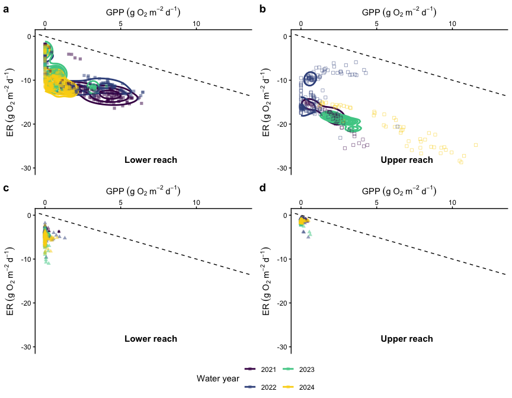

### Potential controls on stream metabolism

Large stream:

    ## Linear mixed model fit by REML. t-tests use Satterthwaite's method [
    ## lmerModLmerTest]
    ## Formula: GPP_mean ~ scale(PAR_inc) + scale(Q_m) + (1 | site)
    ##    Data: bw_dat
    ## 
    ## REML criterion at convergence: 3321.7
    ## 
    ## Scaled residuals: 
    ##     Min      1Q  Median      3Q     Max 
    ## -1.3441 -0.6667 -0.3234  0.6122  4.6445 
    ## 
    ## Random effects:
    ##  Groups   Name        Variance Std.Dev.
    ##  site     (Intercept) 0.08631  0.2938  
    ##  Residual             3.77789  1.9437  
    ## Number of obs: 795, groups:  site, 2
    ## 
    ## Fixed effects:
    ##                 Estimate Std. Error        df t value Pr(>|t|)    
    ## (Intercept)      1.69728    0.22402   1.06294   7.576   0.0745 .  
    ## scale(PAR_inc)   0.45279    0.09322 791.96246   4.857 1.44e-06 ***
    ## scale(Q_m)      -0.65562    0.07975 782.99790  -8.221 8.33e-16 ***
    ## ---
    ## Signif. codes:  0 '***' 0.001 '**' 0.01 '*' 0.05 '.' 0.1 ' ' 1
    ## 
    ## Correlation of Fixed Effects:
    ##             (Intr) s(PAR_
    ## scl(PAR_nc) -0.195       
    ## scale(Q_m)   0.079 -0.216

    ##             R2m      R2c
    ## [1,] 0.08863955 0.108995

#### Check temporal autocorrelation

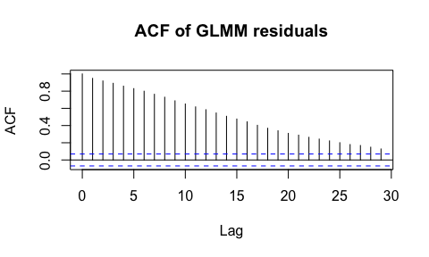

    ##    site       date  n
    ## 1   BWL 2021-06-30  2
    ## 2   BWL 2022-05-26  2
    ## 3   BWL 2022-06-07 12
    ## 4   BWL 2022-08-13  2
    ## 5   BWL 2022-08-24  2
    ## 6   BWL 2022-10-12  2
    ## 7   BWL 2022-11-21  2
    ## 8   BWL 2022-12-19  2
    ## 9   BWL 2023-02-15  2
    ## 10  BWL 2023-04-05  2
    ## 11  BWL 2023-06-18  2
    ## 12  BWL 2023-07-12  4
    ## 13  BWL 2023-07-18  2
    ## 14  BWL 2023-08-10  2
    ## 15  BWL 2023-09-02  3
    ## 16  BWL 2023-09-25  2

    ## Linear mixed-effects model fit by maximum likelihood
    ##   Data: bw_dat 
    ##        AIC      BIC   logLik
    ##   1243.422 1271.401 -615.711
    ## 
    ## Random effects:
    ##  Formula: ~1 | site
    ##         (Intercept) Residual
    ## StdDev:   0.5179229 2.071903
    ## 
    ## Correlation Structure: ARMA(1,0)
    ##  Formula: ~as.numeric(date) | site 
    ##  Parameter estimate(s):
    ##      Phi1 
    ## 0.9713761 
    ## Fixed effects:  GPP_mean ~ scale(PAR_inc) + scale(Q_m) 
    ##                     Value Std.Error  DF    t-value p-value
    ## (Intercept)     1.5354307 0.5570629 779  2.7562968  0.0060
    ## scale(PAR_inc) -0.2871810 0.1585455 779 -1.8113471  0.0705
    ## scale(Q_m)     -0.0010995 0.1189249 779 -0.0092456  0.9926
    ##  Correlation: 
    ##                (Intr) s(PAR_
    ## scale(PAR_inc)  0.100       
    ## scale(Q_m)     -0.022 -0.037
    ## 
    ## Standardized Within-Group Residuals:
    ##         Min          Q1         Med          Q3         Max 
    ## -0.94831716 -0.52325294 -0.08735911  0.80891967  4.69506147 
    ## 
    ## Number of Observations: 783
    ## Number of Groups: 2

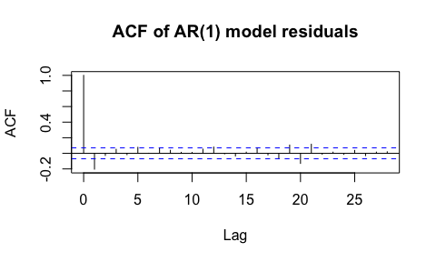

    ## [1] 0.9324217
    ## attr(,"adj.r.squared")
    ## [1] 0.9456815

ER

    ## # A tibble: 0 × 3
    ## # ℹ 3 variables: site <chr>, date <date>, n <int>

    ## Linear mixed-effects model fit by maximum likelihood
    ##   Data: bw_dat 
    ##        AIC      BIC   logLik
    ##   1593.964 1621.105 -790.982
    ## 
    ## Random effects:
    ##  Formula: ~1 | site
    ##          (Intercept) Residual
    ## StdDev: 0.0005270337  6.43511
    ## 
    ## Correlation Structure: ARMA(1,0)
    ##  Formula: ~as.numeric(date) | site 
    ##  Parameter estimate(s):
    ##      Phi1 
    ## 0.9938381 
    ## Fixed effects:  ER_mean ~ scale(Q_m) + scale(wt) 
    ##                  Value Std.Error  DF   t-value p-value
    ## (Intercept) -12.395230 2.3309936 677 -5.317574  0.0000
    ## scale(Q_m)    0.100219 0.1908441 677  0.525135  0.5997
    ## scale(wt)    -0.394422 0.2277142 677 -1.732091  0.0837
    ##  Correlation: 
    ##            (Intr) sc(Q_)
    ## scale(Q_m) -0.003       
    ## scale(wt)   0.044  0.102
    ## 
    ## Standardized Within-Group Residuals:
    ##         Min          Q1         Med          Q3         Max 
    ## -2.48697613 -0.49755174  0.09463662  0.38602895  1.60294943 
    ## 
    ## Number of Observations: 681
    ## Number of Groups: 2

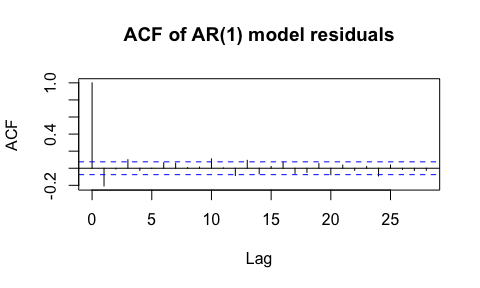

    ## [1] 0.9890338
    ## attr(,"adj.r.squared")
    ## [1] 0.9900976

Small stream:

    ## Linear mixed model fit by REML. t-tests use Satterthwaite's method [
    ## lmerModLmerTest]
    ## Formula: GPP_mean ~ scale(PAR_inc) + scale(Q_m) + (1 | site)
    ##    Data: gb_dat
    ## 
    ## REML criterion at convergence: -1000
    ## 
    ## Scaled residuals: 
    ##     Min      1Q  Median      3Q     Max 
    ## -0.8320 -0.4464 -0.2531 -0.0886 10.3668 
    ## 
    ## Random effects:
    ##  Groups   Name        Variance  Std.Dev.
    ##  site     (Intercept) 6.073e-05 0.007793
    ##  Residual             1.481e-02 0.121684
    ## Number of obs: 743, groups:  site, 2
    ## 
    ## Fixed effects:
    ##                  Estimate Std. Error         df t value Pr(>|t|)    
    ## (Intercept)      0.060079   0.009275   2.358146   6.477    0.015 *  
    ## scale(PAR_inc)   0.026183   0.005162 154.889904   5.072 1.11e-06 ***
    ## scale(Q_m)      -0.012142   0.021588 516.904507  -0.562    0.574    
    ## ---
    ## Signif. codes:  0 '***' 0.001 '**' 0.01 '*' 0.05 '.' 0.1 ' ' 1
    ## 
    ## Correlation of Fixed Effects:
    ##             (Intr) s(PAR_
    ## scl(PAR_nc) 0.371        
    ## scale(Q_m)  0.594  0.217

#### Check temporal autocorrelation

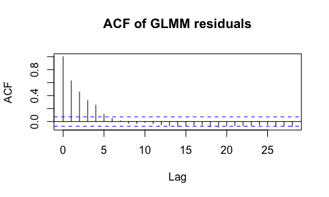

    ##             R2m        R2c
    ## [1,] 0.03946002 0.04338374

    ##   site       date n
    ## 1  GBU 2022-04-07 2
    ## 2  GBU 2022-06-23 2
    ## 3  GBU 2022-10-03 2
    ## 4  GBU 2023-06-15 2
    ## 5  GBU 2023-07-10 8
    ## 6  GBU 2023-08-08 2

    ## Linear mixed-effects model fit by maximum likelihood
    ##   Data: gb_dat 
    ##        AIC       BIC   logLik
    ##   -1344.32 -1316.689 678.1602
    ## 
    ## Random effects:
    ##  Formula: ~1 | site
    ##          (Intercept)  Residual
    ## StdDev: 2.827367e-06 0.1176847
    ## 
    ## Correlation Structure: ARMA(1,0)
    ##  Formula: ~as.numeric(date) | site 
    ##  Parameter estimate(s):
    ##      Phi1 
    ## 0.6101979 
    ## Fixed effects:  GPP_mean ~ scale(PAR_inc) + scale(Q_m) 
    ##                      Value   Std.Error  DF   t-value p-value
    ## (Intercept)     0.04158941 0.007567129 735  5.496062  0.0000
    ## scale(PAR_inc)  0.01469500 0.007639562 735  1.923540  0.0548
    ## scale(Q_m)     -0.00456729 0.006845308 735 -0.667215  0.5048
    ##  Correlation: 
    ##                (Intr) s(PAR_
    ## scale(PAR_inc) -0.100       
    ## scale(Q_m)     -0.014  0.156
    ## 
    ## Standardized Within-Group Residuals:
    ##         Min          Q1         Med          Q3         Max 
    ## -0.61505384 -0.36500052 -0.22816865 -0.02158341 10.79523316 
    ## 
    ## Number of Observations: 739
    ## Number of Groups: 2

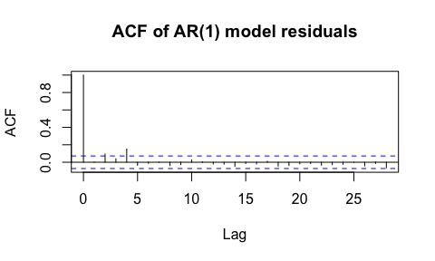

ER

    ## # A tibble: 0 × 3
    ## # ℹ 3 variables: site <chr>, date <date>, n <int>

    ## Linear mixed-effects model fit by maximum likelihood
    ##   Data: gb_dat 
    ##        AIC      BIC    logLik
    ##   1085.935 1112.843 -536.9676
    ## 
    ## Random effects:
    ##  Formula: ~1 | site
    ##         (Intercept) Residual
    ## StdDev:    1.768061 1.061276
    ## 
    ## Correlation Structure: ARMA(1,0)
    ##  Formula: ~as.numeric(date) | site 
    ##  Parameter estimate(s):
    ##      Phi1 
    ## 0.8843456 
    ## Fixed effects:  ER_mean ~ scale(Q_m) + scale(wt) 
    ##                  Value Std.Error  DF   t-value p-value
    ## (Intercept) -3.0060010 1.2587738 651 -2.388039  0.0172
    ## scale(Q_m)  -0.3133967 0.0644846 651 -4.860024  0.0000
    ## scale(wt)    0.0254568 0.1053479 651  0.241646  0.8091
    ##  Correlation: 
    ##            (Intr) sc(Q_)
    ## scale(Q_m) -0.008       
    ## scale(wt)  -0.014  0.247
    ## 
    ## Standardized Within-Group Residuals:
    ##           Min            Q1           Med            Q3           Max 
    ## -5.6060265483 -0.3291508821  0.0007479872  0.4467191297  2.4617139593 
    ## 
    ## Number of Observations: 655
    ## Number of Groups: 2

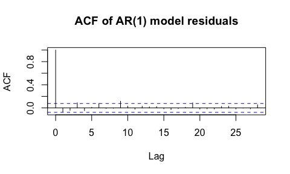

    ## [1] 0.9579001
    ## attr(,"adj.r.squared")
    ## [1] 0.9657904

### *Figure 3*

Setting: Showing the delayed onset of baseflow in wetter years. Color as
water year.

DOY - April 1 = 91 DOY - May 1 = 121 DOY -June 1 = 152 DOY - Sept 1 =
244 DOY - Oct 1 = 274

Read in data from SNOTEL to get SWE timesieries

    ##     site_id          site                date              water_year  
    ##  Min.   :615.0   Length:3672        Min.   :2019-10-01   Min.   :2020  
    ##  1st Qu.:615.0   Class :character   1st Qu.:2021-01-01   1st Qu.:2021  
    ##  Median :731.5   Mode  :character   Median :2022-04-05   Median :2022  
    ##  Mean   :731.5                      Mean   :2022-04-05   Mean   :2022  
    ##  3rd Qu.:848.0                      3rd Qu.:2023-07-08   3rd Qu.:2023  
    ##  Max.   :848.0                      Max.   :2024-10-09   Max.   :2025  
    ##  precipitation     snow_water_equivalent precipitation_cumulative
    ##  Min.   :  0.000   Min.   :   0.0        Min.   :   0.0          
    ##  1st Qu.:  0.000   1st Qu.:   0.0        1st Qu.: 320.0          
    ##  Median :  0.000   Median :  25.4        Median : 650.2          
    ##  Mean   :  3.156   Mean   : 232.7        Mean   : 760.4          
    ##  3rd Qu.:  0.000   3rd Qu.: 381.0        3rd Qu.:1140.5          
    ##  Max.   :292.100   Max.   :1785.6        Max.   :2354.6          
    ##       SWE        
    ##  Min.   :0.0000  
    ##  1st Qu.:0.0000  
    ##  Median :0.0254  
    ##  Mean   :0.2327  
    ##  3rd Qu.:0.3810  
    ##  Max.   :1.7856

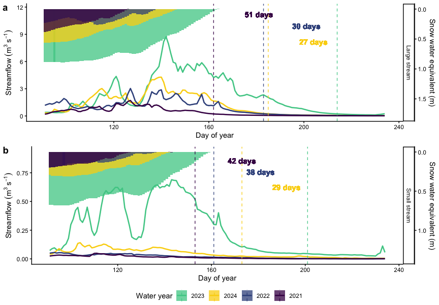

#### Calculate nitrogen demand:

``` r
# Constants
ra <- 0.5  # Autotrophic respiration coefficient (Hall & Tank 2003)
C_Nauto <- 16  # Autotrophic C:N ratio (Stelzer & Lamberti 2001)
C_Nhetero <- 20  # Heterotrophic C:N ratio (Hall & Tank 2003)
HGE <- 0.05  # Heterotrophic Growth Efficiency (Hall & Tank 2003)

# Calculate components of nitrogen demand
covariat_ndemand <- covariat_datq %>%
  group_by(site) %>% 
  mutate(
    # Autotrophic respiration (raGPP)
    raGPP = GPP_mean * ra,
    # Autotrophic assimilation of N
    Auto_N_assim = GPP_mean / C_Nauto,
    # Heterotrophic respiration (Rh)
    Rh = ER_mean - raGPP,
    # Heterotrophic assimilation of N
    Hetero_N_assim = (Rh * HGE) / C_Nhetero,
    # Total nitrogen demand
    Ndemand = Auto_N_assim + Hetero_N_assim, # unit should be g N m-2 d-1
    Ndemand = if_else(Ndemand < 0, 0.0001, Ndemand)) %>%
  dplyr::select(site, date, Ndemand)
```

#### Calculate nitrogen supply:

``` r
covariat_nsupply <- covariat_datqI %>%
  left_join(nitrogen_data, by=c("date", "site")) %>%
  mutate(
    K600_daily_mean = case_when(
      is.na(K600_daily_mean) & site == "BWL" ~ 22, 
      is.na(K600_daily_mean) & site == "BWU" ~ 16,
      is.na(K600_daily_mean) & site == "GBU" ~ 32,
      is.na(K600_daily_mean) & site == "GBL" ~ 25,
      TRUE ~ K600_daily_mean)) %>%
  mutate(Q_Ls = Q_m * 1000, # flow from csm to Ls
  # calculate reach length in m
  reachL = c((v_m_apr*w_m_apr*8640)/K600_daily_mean), # seconds to days
   # Calculate no3 supply 
  NO3_supply = c(((86400*Q_Ls*(NO3_mgL_dl_sw/1000))/(w_m_apr*reachL))),
  NO3_supply_new = c(((86400*Q_Ls*(NO3_mgL_i/1000))/(w_m_apr*reachL))),

   # Calculate nh3 supply 
  NH4_supply = c(((86400*Q_Ls*(NH4_mgL_dl_sw/1000))/(w_m_apr*reachL))), ## unit should be g N m-2 d-1
 NH4_supply_new = c(((86400*Q_Ls*(NH4_mgL_i/1000))/(w_m_apr*reachL))),
  PO4_supply = c(((86400*Q_Ls*(PO4_ugL_dl_sw/1e-6))/(w_m_apr*reachL))) ## unit should be g N m-2 d-1
   )  %>%
  dplyr::select(site, date, reachL, Q_Ls, NO3_supply, 
                NO3_supply_new, NH4_supply, PO4_supply, NH4_supply_new, NO3_mgL_i, NH4_mgL_i, PO4_ugL_dl_sw)
```

##### Plots of Ratios of NH4+- N supply to demand, ratios NO3– N supply to demand

Color is now also by water year 2021-2024, and shape is reach location.

### *Figure 4*

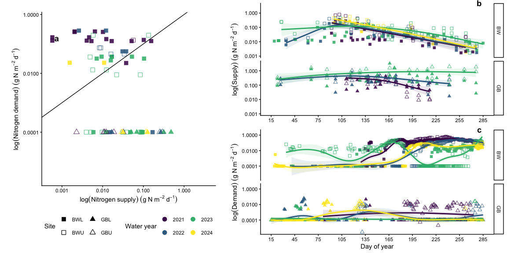

## Dry to wet year comparisons

### ANOVA’s for differences in at each reach

##### Nitrate supply:

``` r
# Define the water years you want on the x-axis, including 2021
desired_years <- c("2021", "2022", "2023")

anova_n03_sup_bw <- aov(NO3_supply_new ~ as.factor(water_year), data = covariat_NS_ND%>%filter(site == "BWL", water_year %in% 2021:2023))
summary(anova_n03_sup_bw)
```

    ##                       Df Sum Sq  Mean Sq F value Pr(>F)
    ## as.factor(water_year)  2 0.0262 0.013104   1.796  0.177
    ## Residuals             48 0.3503 0.007297               
    ## 874 observations deleted due to missingness

``` r
posthoc_n03 <- TukeyHSD(anova_n03_sup_bw)
posthoc_n03
```

    ##   Tukey multiple comparisons of means
    ##     95% family-wise confidence level
    ## 
    ## Fit: aov(formula = NO3_supply_new ~ as.factor(water_year), data = covariat_NS_ND %>% filter(site == "BWL", water_year %in% 2021:2023))
    ## 
    ## $`as.factor(water_year)`
    ##                  diff         lwr        upr     p adj
    ## 2022-2021 -0.05884508 -0.13502429 0.01733413 0.1590054
    ## 2023-2021 -0.04387009 -0.11930848 0.03156830 0.3456679
    ## 2023-2022  0.01497499 -0.05121061 0.08116059 0.8483926

``` r
#  there are no statistical diffs


anova_n03_sup_bw <- aov(NO3_supply_new ~ as.factor(water_year), data = covariat_NS_ND%>%filter(site == "BWU", water_year %in% 2021:2023))
summary(anova_n03_sup_bw)
```

    ##                       Df Sum Sq Mean Sq F value Pr(>F)
    ## as.factor(water_year)  2 0.1024 0.05120   1.925  0.153
    ## Residuals             72 1.9147 0.02659               
    ## 850 observations deleted due to missingness

``` r
posthoc_n03 <- TukeyHSD(anova_n03_sup_bw)
posthoc_n03
```

    ##   Tukey multiple comparisons of means
    ##     95% family-wise confidence level
    ## 
    ## Fit: aov(formula = NO3_supply_new ~ as.factor(water_year), data = covariat_NS_ND %>% filter(site == "BWU", water_year %in% 2021:2023))
    ## 
    ## $`as.factor(water_year)`
    ##                   diff        lwr        upr     p adj
    ## 2022-2021 -0.088767816 -0.2158115 0.03827584 0.2228816
    ## 2023-2021 -0.091060965 -0.2083170 0.02619502 0.1582919
    ## 2023-2022 -0.002293149 -0.1064662 0.10187992 0.9984712

``` r
#  there are no statistically diffs

anova_n03_sup_gb <- aov(NO3_supply_new ~ as.factor(water_year), data = covariat_NS_ND%>%filter(site == "GBL", water_year %in% 2021:2023))
summary(anova_n03_sup_gb)
```

    ##                       Df Sum Sq Mean Sq F value Pr(>F)  
    ## as.factor(water_year)  2  2.103  1.0513   4.114 0.0237 *
    ## Residuals             40 10.221  0.2555                 
    ## ---
    ## Signif. codes:  0 '***' 0.001 '**' 0.01 '*' 0.05 '.' 0.1 ' ' 1
    ## 882 observations deleted due to missingness

``` r
posthoc_n03 <- TukeyHSD(anova_n03_sup_gb)
posthoc_n03
```

    ##   Tukey multiple comparisons of means
    ##     95% family-wise confidence level
    ## 
    ## Fit: aov(formula = NO3_supply_new ~ as.factor(water_year), data = covariat_NS_ND %>% filter(site == "GBL", water_year %in% 2021:2023))
    ## 
    ## $`as.factor(water_year)`
    ##                diff         lwr       upr     p adj
    ## 2022-2021 0.1055031 -0.41200495 0.6230112 0.8735306
    ## 2023-2021 0.4962914  0.01978306 0.9727997 0.0396342
    ## 2023-2022 0.3907883 -0.04753563 0.8291122 0.0888481

``` r
#  2023 was significantly greater than 2021

anova_n03_sup_gbu <- aov(NO3_supply_new ~ as.factor(water_year), data = covariat_NS_ND%>%filter(site == "GBU", water_year %in% 2021:2023))
summary(anova_n03_sup_gbu)
```

    ##                       Df Sum Sq Mean Sq F value   Pr(>F)    
    ## as.factor(water_year)  2  6.974   3.487   18.26 3.35e-06 ***
    ## Residuals             36  6.876   0.191                     
    ## ---
    ## Signif. codes:  0 '***' 0.001 '**' 0.01 '*' 0.05 '.' 0.1 ' ' 1
    ## 886 observations deleted due to missingness

``` r
posthoc_n03 <- TukeyHSD(anova_n03_sup_gbu)
posthoc_n03
```

    ##   Tukey multiple comparisons of means
    ##     95% family-wise confidence level
    ## 
    ## Fit: aov(formula = NO3_supply_new ~ as.factor(water_year), data = covariat_NS_ND %>% filter(site == "GBU", water_year %in% 2021:2023))
    ## 
    ## $`as.factor(water_year)`
    ##                diff        lwr      upr     p adj
    ## 2022-2021 0.1269780 -0.3440619 0.598018 0.7885473
    ## 2023-2021 0.9157813  0.4796830 1.351880 0.0000293
    ## 2023-2022 0.7888032  0.3907019 1.186905 0.0000707

``` r
#  2023 was significantly greater than 2021
```

##### Ammonium supply:

``` r
# Define the water years you want on the x-axis, including 2021
desired_years <- c("2021", "2022", "2023")

anova_nh4_sup_bw <- aov(NH4_supply_new ~ as.factor(water_year), data = covariat_NS_ND%>%filter(site == "BWL", water_year %in% 2021:2023))
summary(anova_nh4_sup_bw)
```

    ##                       Df   Sum Sq   Mean Sq F value Pr(>F)  
    ## as.factor(water_year)  2 0.000607 3.035e-04   3.374 0.0416 *
    ## Residuals             54 0.004858 8.997e-05                 
    ## ---
    ## Signif. codes:  0 '***' 0.001 '**' 0.01 '*' 0.05 '.' 0.1 ' ' 1
    ## 868 observations deleted due to missingness

``` r
posthoc_nh4 <- TukeyHSD(anova_nh4_sup_bw)
posthoc_nh4
```

    ##   Tukey multiple comparisons of means
    ##     95% family-wise confidence level
    ## 
    ## Fit: aov(formula = NH4_supply_new ~ as.factor(water_year), data = covariat_NS_ND %>% filter(site == "BWL", water_year %in% 2021:2023))
    ## 
    ## $`as.factor(water_year)`
    ##                  diff           lwr         upr     p adj
    ## 2022-2021 0.001013747 -0.0073333518 0.009360846 0.9539148
    ## 2023-2021 0.007001370 -0.0003600789 0.014362819 0.0654820
    ## 2023-2022 0.005987623 -0.0013738259 0.013349072 0.1320129

``` r
#  2021 is more than 2023 


anova_nh4_sup_bw <- aov(NH4_supply_new ~ as.factor(water_year), data = covariat_NS_ND%>%filter(site == "BWU", water_year %in% 2021:2023))
summary(anova_nh4_sup_bw)
```

    ##                       Df  Sum Sq  Mean Sq F value Pr(>F)
    ## as.factor(water_year)  2 0.00358 0.001790   0.399  0.675
    ## Residuals             23 0.10310 0.004483               
    ## 899 observations deleted due to missingness

``` r
posthoc_nh4 <- TukeyHSD(anova_nh4_sup_bw)
posthoc_nh4
```

    ##   Tukey multiple comparisons of means
    ##     95% family-wise confidence level
    ## 
    ## Fit: aov(formula = NH4_supply_new ~ as.factor(water_year), data = covariat_NS_ND %>% filter(site == "BWU", water_year %in% 2021:2023))
    ## 
    ## $`as.factor(water_year)`
    ##                   diff         lwr       upr     p adj
    ## 2022-2021 -0.006345118 -0.11882213 0.1061319 0.9890621
    ## 2023-2021  0.020832945 -0.07234491 0.1140108 0.8424469
    ## 2023-2022  0.027178063 -0.05812397 0.1124801 0.7080245

``` r
#  there are no statistically diffs

anova_nh4_sup_gb <- aov(NH4_supply_new ~ as.factor(water_year), data = covariat_NS_ND%>%filter(site == "GBL", water_year %in% 2021:2023))
summary(anova_nh4_sup_gb)
```

    ##                       Df Sum Sq Mean Sq F value  Pr(>F)   
    ## as.factor(water_year)  2 0.2410 0.12050    5.89 0.00573 **
    ## Residuals             40 0.8183 0.02046                   
    ## ---
    ## Signif. codes:  0 '***' 0.001 '**' 0.01 '*' 0.05 '.' 0.1 ' ' 1
    ## 882 observations deleted due to missingness

``` r
posthoc_nh4 <- TukeyHSD(anova_nh4_sup_gb)
posthoc_nh4
```

    ##   Tukey multiple comparisons of means
    ##     95% family-wise confidence level
    ## 
    ## Fit: aov(formula = NH4_supply_new ~ as.factor(water_year), data = covariat_NS_ND %>% filter(site == "GBL", water_year %in% 2021:2023))
    ## 
    ## $`as.factor(water_year)`
    ##                   diff         lwr       upr     p adj
    ## 2022-2021 -0.001172495 -0.14760214 0.1452571 0.9997906
    ## 2023-2021  0.149426088  0.01459738 0.2842548 0.0269221
    ## 2023-2022  0.150598583  0.02657421 0.2746230 0.0141229

``` r
#  2023 was significantly greater than 2021 and 2022

anova_nh4_sup_gbu <- aov(NH4_supply_new ~ as.factor(water_year), data = covariat_NS_ND%>%filter(site == "GBU", water_year %in% 2021:2023))
summary(anova_nh4_sup_gbu)
```

    ##                       Df Sum Sq Mean Sq F value   Pr(>F)    
    ## as.factor(water_year)  2 0.6727  0.3363   9.566 0.000466 ***
    ## Residuals             36 1.2657  0.0352                     
    ## ---
    ## Signif. codes:  0 '***' 0.001 '**' 0.01 '*' 0.05 '.' 0.1 ' ' 1
    ## 886 observations deleted due to missingness

``` r
posthoc_nh4 <- TukeyHSD(anova_nh4_sup_gbu)
posthoc_nh4
```

    ##   Tukey multiple comparisons of means
    ##     95% family-wise confidence level
    ## 
    ## Fit: aov(formula = NH4_supply_new ~ as.factor(water_year), data = covariat_NS_ND %>% filter(site == "GBU", water_year %in% 2021:2023))
    ## 
    ## $`as.factor(water_year)`
    ##                diff         lwr       upr     p adj
    ## 2022-2021 0.0975629 -0.10453568 0.2996615 0.4725668
    ## 2023-2021 0.3094239  0.12231697 0.4965308 0.0007622
    ## 2023-2022 0.2118610  0.04105653 0.3826655 0.0121782

``` r
#  2023 was significantly greater than 2021
```

##### N demand:

``` r
# Define the water years you want on the x-axis, including 2021
desired_years <- c("2021", "2022", "2023")

anova_Ndemand_bw <- aov(Ndemand ~ as.factor(water_year), data = covariat_NS_ND%>%filter(site == "BWL", water_year %in% 2021:2023))
summary(anova_Ndemand_bw)
```

    ##                        Df Sum Sq Mean Sq F value Pr(>F)    
    ## as.factor(water_year)   2  1.206  0.6031    76.2 <2e-16 ***
    ## Residuals             354  2.801  0.0079                   
    ## ---
    ## Signif. codes:  0 '***' 0.001 '**' 0.01 '*' 0.05 '.' 0.1 ' ' 1
    ## 568 observations deleted due to missingness

``` r
posthoc_dem <- TukeyHSD(anova_Ndemand_bw)
posthoc_dem
```

    ##   Tukey multiple comparisons of means
    ##     95% family-wise confidence level
    ## 
    ## Fit: aov(formula = Ndemand ~ as.factor(water_year), data = covariat_NS_ND %>% filter(site == "BWL", water_year %in% 2021:2023))
    ## 
    ## $`as.factor(water_year)`
    ##                  diff         lwr         upr    p adj
    ## 2022-2021 -0.04907955 -0.07527182 -0.02288728 4.07e-05
    ## 2023-2021 -0.14411256 -0.17174715 -0.11647798 0.00e+00
    ## 2023-2022 -0.09503301 -0.12314829 -0.06691774 0.00e+00

``` r
#  Nitrogen demand declined progressively from 2021 > 2022 > 2023


anova_Ndemand_bw <- aov(Ndemand ~ as.factor(water_year), data = covariat_NS_ND%>%filter(site == "BWU", water_year %in% 2021:2023))
summary(anova_Ndemand_bw)
```

    ##                        Df Sum Sq Mean Sq F value Pr(>F)    
    ## as.factor(water_year)   2  2.966  1.4829   166.2 <2e-16 ***
    ## Residuals             263  2.347  0.0089                   
    ## ---
    ## Signif. codes:  0 '***' 0.001 '**' 0.01 '*' 0.05 '.' 0.1 ' ' 1
    ## 659 observations deleted due to missingness

``` r
posthoc_dem <- TukeyHSD(anova_Ndemand_bw)
posthoc_dem
```

    ##   Tukey multiple comparisons of means
    ##     95% family-wise confidence level
    ## 
    ## Fit: aov(formula = Ndemand ~ as.factor(water_year), data = covariat_NS_ND %>% filter(site == "BWU", water_year %in% 2021:2023))
    ## 
    ## $`as.factor(water_year)`
    ##                  diff         lwr          upr     p adj
    ## 2022-2021 -0.22985984 -0.27253172 -0.187187967 0.0000000
    ## 2023-2021 -0.27216283 -0.30753668 -0.236788981 0.0000000
    ## 2023-2022 -0.04230299 -0.07696122 -0.007644757 0.0120509

``` r
#  Nitrogen demand also declined progressively from 2021 > 2022 > 2023

anovaNdemand_gb <- aov(Ndemand ~ as.factor(water_year), data = covariat_NS_ND%>%filter(site == "GBL", water_year %in% 2021:2023))
summary(anovaNdemand_gb)
```

    ##                        Df   Sum Sq   Mean Sq F value Pr(>F)  
    ## as.factor(water_year)   2 0.000236 1.180e-04   2.681 0.0705 .
    ## Residuals             249 0.010963 4.403e-05                 
    ## ---
    ## Signif. codes:  0 '***' 0.001 '**' 0.01 '*' 0.05 '.' 0.1 ' ' 1
    ## 673 observations deleted due to missingness

``` r
posthoc_dem <- TukeyHSD(anovaNdemand_gb)
posthoc_dem
```

    ##   Tukey multiple comparisons of means
    ##     95% family-wise confidence level
    ## 
    ## Fit: aov(formula = Ndemand ~ as.factor(water_year), data = covariat_NS_ND %>% filter(site == "GBL", water_year %in% 2021:2023))
    ## 
    ## $`as.factor(water_year)`
    ##                   diff          lwr          upr     p adj
    ## 2022-2021 -0.001677000 -0.005717518 0.0023635179 0.5910737
    ## 2023-2021 -0.003251657 -0.007333918 0.0008306037 0.1471840
    ## 2023-2022 -0.001574657 -0.003622527 0.0004732122 0.1674134

``` r
#  No evidence that nitrogen demand differed among years

anovaNdemand_gbu <- aov(Ndemand ~ as.factor(water_year), data = covariat_NS_ND%>%filter(site == "GBU", water_year %in% 2021:2023))
summary(anovaNdemand_gbu)
```

    ##                        Df   Sum Sq   Mean Sq F value   Pr(>F)    
    ## as.factor(water_year)   2 0.000393 1.965e-04    7.89 0.000491 ***
    ## Residuals             219 0.005455 2.491e-05                     
    ## ---
    ## Signif. codes:  0 '***' 0.001 '**' 0.01 '*' 0.05 '.' 0.1 ' ' 1
    ## 703 observations deleted due to missingness

``` r
posthoc_dem <- TukeyHSD(anovaNdemand_gbu)
posthoc_dem
```

    ##   Tukey multiple comparisons of means
    ##     95% family-wise confidence level
    ## 
    ## Fit: aov(formula = Ndemand ~ as.factor(water_year), data = covariat_NS_ND %>% filter(site == "GBU", water_year %in% 2021:2023))
    ## 
    ## $`as.factor(water_year)`
    ##                   diff          lwr           upr     p adj
    ## 2022-2021 -0.002073504 -0.003932355 -0.0002146518 0.0245563
    ## 2023-2021 -0.003148422 -0.005117830 -0.0011790147 0.0006075
    ## 2023-2022 -0.001074919 -0.003182995  0.0010331573 0.4525103

``` r
#  Nitrogen demand declined in 2023 relative to the previous two years
```

### Change from wet to dry

##### NO3 supply

    ## # A tibble: 4 × 7
    ##   site  mean_NO3_2021_2022 mean_NO3_2023 n_2021_2022 n_2023 delta_wet_dry
    ##   <chr>              <dbl>         <dbl>       <int>  <int>         <dbl>
    ## 1 BWL               0.0756        0.0678          31     20      -0.00780
    ## 2 BWU               0.139         0.100           39     36      -0.0387 
    ## 3 GBL               0.255         0.692           23     20       0.437  
    ## 4 GBU               0.284         1.13            21     18       0.843  
    ## # ℹ 1 more variable: pct_change <dbl>

##### NH4 supply

    ## # A tibble: 4 × 7
    ##   site  mean_NH4_2021_2022 mean_NH4_2023 n_2021_2022 n_2023 delta_wet_dry
    ##   <chr>              <dbl>         <dbl>       <int>  <int>         <dbl>
    ## 1 BWL               0.0139        0.0204          30     27       0.00649
    ## 2 BWU               0.0381        0.0625           9     17       0.0244 
    ## 3 GBL               0.134         0.285           23     20       0.150  
    ## 4 GBU               0.146         0.400           21     18       0.254  
    ## # ℹ 1 more variable: pct_change <dbl>

#### N demand

    ## # A tibble: 4 × 7
    ##   site  mean_Ndemand_2021_2022 mean_Ndemand_2023 n_2021_2022 n_2023
    ##   <chr>                  <dbl>             <dbl>       <int>  <int>
    ## 1 BWL                  0.150            0.0297           256    101
    ## 2 BWU                  0.187            0.0330           109    157
    ## 3 GBL                  0.00213          0.000355         144    108
    ## 4 GBU                  0.00334          0.00106          165     57
    ## # ℹ 2 more variables: delta_wet_dry <dbl>, pct_change <dbl>

### *Figure 5*

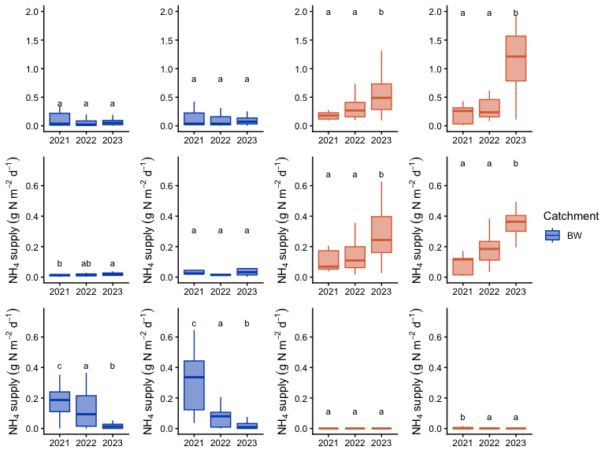

#### SI figures

### Comparable cumulative metabolism

Where days that the model can’t identify GPP (in green) or ER (orange)
but there is DO, we then assume the metabolism (GPP/ER) to be 0

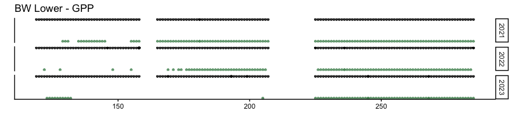

    ## # A tibble: 1 × 4
    ##   dry_mean wet_2023  diff pct_decrease
    ##      <dbl>    <dbl> <dbl>        <dbl>
    ## 1     347.     48.4 -298.        -86.1

## Wet to dry 102.0758

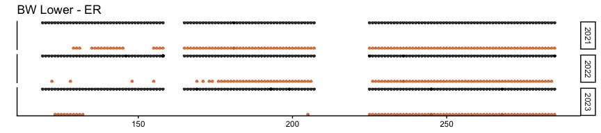

    ## # A tibble: 1 × 4
    ##   dry_mean wet_2023  diff pct_decrease
    ##      <dbl>    <dbl> <dbl>        <dbl>
    ## 1    1232.     621. -611.        -49.6

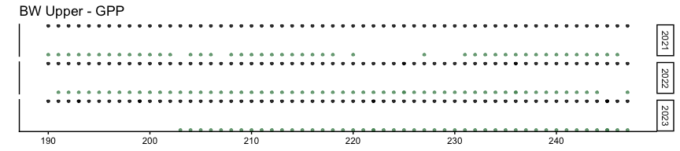

    ## # A tibble: 1 × 4
    ##   dry_mean wet_2023  diff pct_decrease
    ##      <dbl>    <dbl> <dbl>        <dbl>
    ## 1     203.     5.98 -197.        -97.1

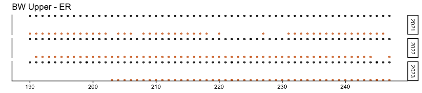

    ## # A tibble: 1 × 4
    ##   dry_mean wet_2023  diff pct_decrease
    ##      <dbl>    <dbl> <dbl>        <dbl>
    ## 1    1005.     740. -264.        -26.3

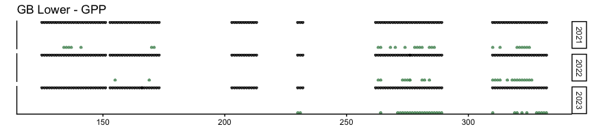

    ## # A tibble: 1 × 4
    ##   dry_mean wet_2023   diff pct_decrease
    ##      <dbl>    <dbl>  <dbl>        <dbl>
    ## 1     1.05    0.273 -0.779        -74.1

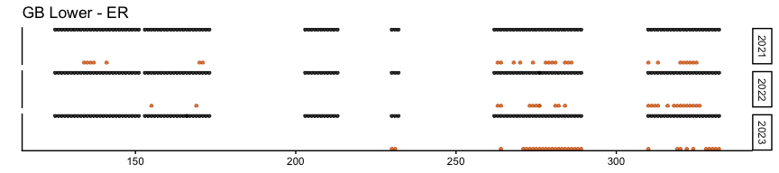

    ## # A tibble: 1 × 4
    ##   dry_mean wet_2023  diff pct_decrease
    ##      <dbl>    <dbl> <dbl>        <dbl>
    ## 1     108.     165.  57.0         53.0

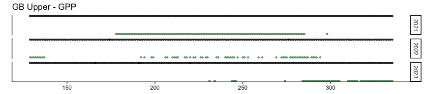

    ## # A tibble: 1 × 4
    ##   dry_mean wet_2023  diff pct_decrease
    ##      <dbl>    <dbl> <dbl>        <dbl>
    ## 1     6.86   0.0530 -6.81        -99.2

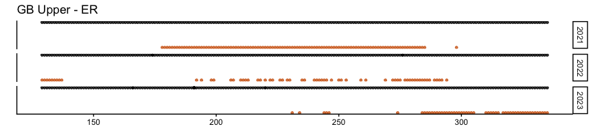

    ## # A tibble: 1 × 4
    ##   dry_mean wet_2023  diff pct_decrease
    ##      <dbl>    <dbl> <dbl>        <dbl>
    ## 1     98.9     72.0 -26.9         27.2

#### Cummulative GPP and ER

From overlapping DOY observations in each year.

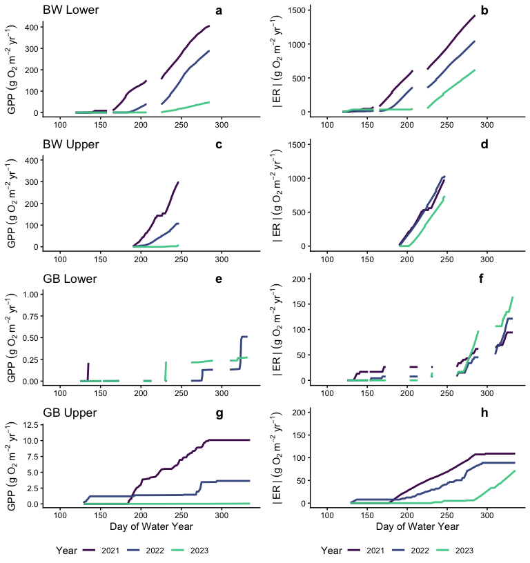

End of script.
