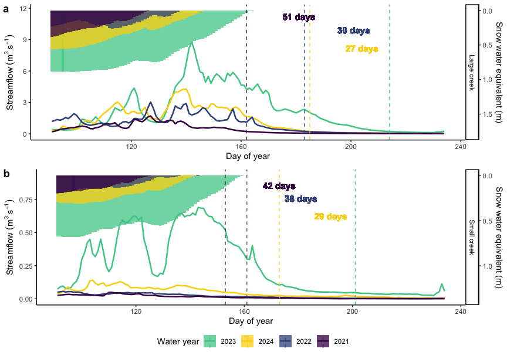
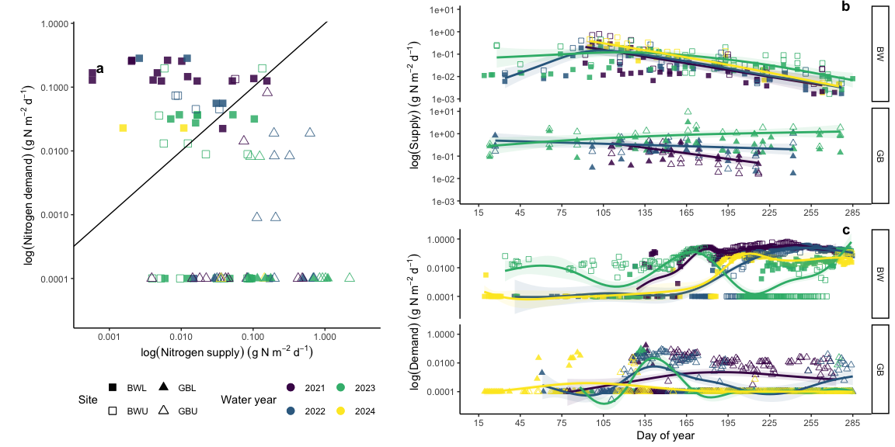
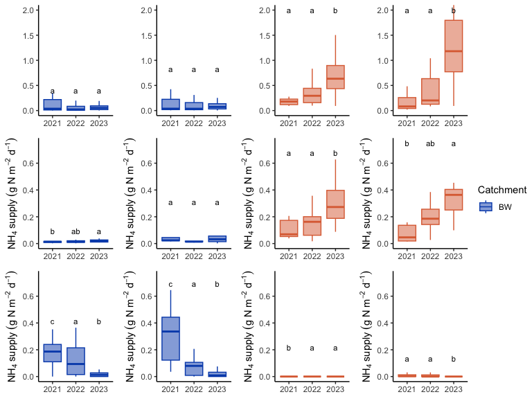
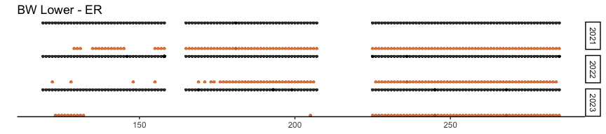
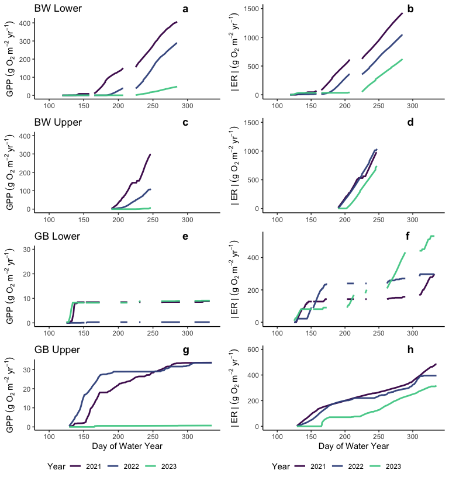

Analysis for Mountain stream ecosystem metabolism and nitrogen cycling
responses to hydroclimatic volatility
================
Kelly Loria
2026-02-16

<style type="text/css">
body, td {font-size: 13px;}
code.r{font-size: 9px;}
pre {font-size: 11px}
</style>

### MS: Spatiotemporal variation in mountain stream metabolism and nitrogen cycling across contrasting flow regimes

##### Kernal density plots of GPP and ER

Colored by years

### *Figure 2*

GPP and ER regimes at each reach.

<!-- -->

### *Figure 3*

Setting: Showing the delayed onset of baseflow in wetter years. Color as
water year.

DOY - April 1 = 91 DOY - May 1 = 121 DOY -June 1 = 152 DOY - Sept 1 =
244 DOY - Oct 1 = 274

Read in data from SNOTEL to get SWE timesieries

    ##     site_id          site                date              water_year   precipitation    
    ##  Min.   :615.0   Length:3672        Min.   :2019-10-01   Min.   :2020   Min.   :  0.000  
    ##  1st Qu.:615.0   Class :character   1st Qu.:2021-01-01   1st Qu.:2021   1st Qu.:  0.000  
    ##  Median :731.5   Mode  :character   Median :2022-04-05   Median :2022   Median :  0.000  
    ##  Mean   :731.5                      Mean   :2022-04-05   Mean   :2022   Mean   :  3.154  
    ##  3rd Qu.:848.0                      3rd Qu.:2023-07-08   3rd Qu.:2023   3rd Qu.:  0.000  
    ##  Max.   :848.0                      Max.   :2024-10-09   Max.   :2025   Max.   :292.100  
    ##  snow_water_equivalent precipitation_cumulative      SWE        
    ##  Min.   :   0.0        Min.   :   0.0           Min.   :0.0000  
    ##  1st Qu.:   0.0        1st Qu.: 320.0           1st Qu.:0.0000  
    ##  Median :  25.4        Median : 650.2           Median :0.0254  
    ##  Mean   : 232.7        Mean   : 760.4           Mean   :0.2327  
    ##  3rd Qu.: 381.0        3rd Qu.:1140.5           3rd Qu.:0.3810  
    ##  Max.   :1785.6        Max.   :2354.6           Max.   :1.7856

<!-- -->

#### Calculate nitrogen demand:

``` r
# Constants
ra <- 0.5  # Autotrophic respiration coefficient (Hall & Tank 2003)
C_Nauto <- 16  # Autotrophic C:N ratio (Stelzer & Lamberti 2001)
C_Nhetero <- 20  # Heterotrophic C:N ratio (Hall & Tank 2003)
HGE <- 0.05  # Heterotrophic Growth Efficiency (Hall & Tank 2003)

# Calculate components of nitrogen demand
covariat_ndemand <- covariat_datq %>%
  group_by(site) %>% 
  mutate(
    # Autotrophic respiration (raGPP)
    raGPP = GPP_mean * ra,
    # Autotrophic assimilation of N
    Auto_N_assim = GPP_mean / C_Nauto,
    # Heterotrophic respiration (Rh)
    Rh = ER_mean - raGPP,
    # Heterotrophic assimilation of N
    Hetero_N_assim = (Rh * HGE) / C_Nhetero,
    # Total nitrogen demand
    Ndemand = Auto_N_assim + Hetero_N_assim, # unit should be g N m-2 d-1
    Ndemand = if_else(Ndemand < 0, 0.0001, Ndemand)) %>%
  dplyr::select(site, date, Ndemand)
```

#### Calculate nitrogen supply:

``` r
covariat_nsupply <- covariat_datqI %>%
  left_join(nitrogen_data, by=c("date", "site")) %>%
  mutate(
    K600_daily_mean = case_when(
      is.na(K600_daily_mean) & site == "BWL" ~ 22, 
      is.na(K600_daily_mean) & site == "BWU" ~ 16,
      is.na(K600_daily_mean) & site == "GBU" ~ 32,
      is.na(K600_daily_mean) & site == "GBL" ~ 25,
      TRUE ~ K600_daily_mean)) %>%
  mutate(Q_Ls = Q_m * 1000, # flow from csm to Ls
  # calculate reach length in m
  reachL = c((v_m_apr*w_m_apr*8640)/K600_daily_mean), # seconds to days
   # Calculate no3 supply 
  NO3_supply = c(((86400*Q_Ls*(NO3_mgL_dl_sw/1000))/(w_m_apr*reachL))),
  NO3_supply_new = c(((86400*Q_Ls*(NO3_mgL_i/1000))/(w_m_apr*reachL))),

   # Calculate nh3 supply 
  NH4_supply = c(((86400*Q_Ls*(NH4_mgL_dl_sw/1000))/(w_m_apr*reachL))), ## unit should be g N m-2 d-1
 NH4_supply_new = c(((86400*Q_Ls*(NH4_mgL_i/1000))/(w_m_apr*reachL))),
  PO4_supply = c(((86400*Q_Ls*(PO4_ugL_dl_sw/1e-6))/(w_m_apr*reachL))) ## unit should be g N m-2 d-1
   )  %>%
  dplyr::select(site, date, reachL, Q_Ls, NO3_supply, 
                NO3_supply_new, NH4_supply, PO4_supply, NH4_supply_new, NO3_mgL_i, NH4_mgL_i, PO4_ugL_dl_sw)
```

##### Plots of Ratios of NH4+- N supply to demand, ratios NO3– N supply to demand

Color is now also by water year 2021-2024, and shape is reach location.

### *Figure 4*

<!-- -->

## Dry to wet year comparisons

### ANOVA’s for differences in at each reach

##### GPP:

``` r
# Define the water years you want on the x-axis, including 2021
desired_years <- c("2021", "2022", "2023")

anova_n03_sup_bw <- aov(NO3_supply_new ~ as.factor(water_year), data = covariat_NS_ND%>%filter(site == "BWL", water_year %in% 2021:2023))
summary(anova_n03_sup_bw)
```

    ##                       Df Sum Sq  Mean Sq F value Pr(>F)
    ## as.factor(water_year)  2 0.0262 0.013104   1.796  0.177
    ## Residuals             48 0.3503 0.007297               
    ## 874 observations deleted due to missingness

``` r
posthoc_n03 <- TukeyHSD(anova_n03_sup_bw)
posthoc_n03
```

    ##   Tukey multiple comparisons of means
    ##     95% family-wise confidence level
    ## 
    ## Fit: aov(formula = NO3_supply_new ~ as.factor(water_year), data = covariat_NS_ND %>% filter(site == "BWL", water_year %in% 2021:2023))
    ## 
    ## $`as.factor(water_year)`
    ##                  diff         lwr        upr     p adj
    ## 2022-2021 -0.05884508 -0.13502429 0.01733413 0.1590054
    ## 2023-2021 -0.04387009 -0.11930848 0.03156830 0.3456679
    ## 2023-2022  0.01497499 -0.05121061 0.08116059 0.8483926

``` r
#  there are no statistical diffs


anova_n03_sup_bw <- aov(NO3_supply_new ~ as.factor(water_year), data = covariat_NS_ND%>%filter(site == "BWU", water_year %in% 2021:2023))
summary(anova_n03_sup_bw)
```

    ##                       Df Sum Sq Mean Sq F value Pr(>F)
    ## as.factor(water_year)  2 0.1024 0.05120   1.925  0.153
    ## Residuals             72 1.9147 0.02659               
    ## 850 observations deleted due to missingness

``` r
posthoc_n03 <- TukeyHSD(anova_n03_sup_bw)
posthoc_n03
```

    ##   Tukey multiple comparisons of means
    ##     95% family-wise confidence level
    ## 
    ## Fit: aov(formula = NO3_supply_new ~ as.factor(water_year), data = covariat_NS_ND %>% filter(site == "BWU", water_year %in% 2021:2023))
    ## 
    ## $`as.factor(water_year)`
    ##                   diff        lwr        upr     p adj
    ## 2022-2021 -0.088767816 -0.2158115 0.03827584 0.2228816
    ## 2023-2021 -0.091060965 -0.2083170 0.02619502 0.1582919
    ## 2023-2022 -0.002293149 -0.1064662 0.10187992 0.9984712

``` r
#  there are no statistically diffs

anova_n03_sup_gb <- aov(NO3_supply_new ~ as.factor(water_year), data = covariat_NS_ND%>%filter(site == "GBL", water_year %in% 2021:2023))
summary(anova_n03_sup_gb)
```

    ##                       Df Sum Sq Mean Sq F value  Pr(>F)   
    ## as.factor(water_year)  2  2.734  1.3672   5.483 0.00786 **
    ## Residuals             40  9.973  0.2493                   
    ## ---
    ## Signif. codes:  0 '***' 0.001 '**' 0.01 '*' 0.05 '.' 0.1 ' ' 1
    ## 882 observations deleted due to missingness

``` r
posthoc_n03 <- TukeyHSD(anova_n03_sup_gb)
posthoc_n03
```

    ##   Tukey multiple comparisons of means
    ##     95% family-wise confidence level
    ## 
    ## Fit: aov(formula = NO3_supply_new ~ as.factor(water_year), data = covariat_NS_ND %>% filter(site == "GBL", water_year %in% 2021:2023))
    ## 
    ## $`as.factor(water_year)`
    ##                diff          lwr       upr     p adj
    ## 2022-2021 0.1310361 -0.380154645 0.6422268 0.8079292
    ## 2023-2021 0.5705797  0.099888221 1.0412712 0.0143051
    ## 2023-2022 0.4395436  0.006570422 0.8725169 0.0459639

``` r
#  there are no statistically diffs
```

##### NO3 supply

    ## # A tibble: 4 × 7
    ##   site  mean_NO3_2021_2022 mean_NO3_2023 n_2021_2022 n_2023 delta_wet_dry pct_change
    ##   <chr>              <dbl>         <dbl>       <int>  <int>         <dbl>      <dbl>
    ## 1 BWL               0.0756        0.0678          31     20      -0.00780        -10
    ## 2 BWU               0.139         0.100           39     36      -0.0387         -28
    ## 3 GBL               0.270         0.766           23     20       0.497          184
    ## 4 GBU               0.287         1.56            21     18       1.27           443

##### NH4 supply

``` r
desired_years <- c("2021","2022","2023")

nh4_mean_diff_wet_dry <- covariat_NS_ND %>%
  filter(water_year %in% 2021:2023) %>%
  mutate(
    water_year = as.integer(water_year),
    year_group = case_when(
      water_year %in% c(2021, 2022) ~ "2021_2022",
      water_year == 2023            ~ "2023",
      TRUE                          ~ NA_character_
    )
  ) %>%
  filter(!is.na(year_group)) %>%
  group_by(site, year_group) %>%
  summarise(
    mean_NH4 = mean(NH4_supply_new, na.rm = TRUE),
    n = sum(!is.na(NH4_supply_new)),
    .groups = "drop"
  ) %>%
  tidyr::pivot_wider(
    names_from = year_group,
    values_from = c(mean_NH4, n)
  ) %>%
  mutate(
    # mean difference relative to 2023 (same sign convention as your statement: "rose" => positive)
    delta_wet_dry = mean_NH4_2023- mean_NH4_2021_2022,
    # percent difference relative to 2023
    pct_change = round(100 * (mean_NH4_2023- mean_NH4_2021_2022) / mean_NH4_2021_2022)
  ) %>%
  arrange(site)

nh4_mean_diff_wet_dry
```

    ## # A tibble: 4 × 7
    ##   site  mean_NH4_2021_2022 mean_NH4_2023 n_2021_2022 n_2023 delta_wet_dry pct_change
    ##   <chr>              <dbl>         <dbl>       <int>  <int>         <dbl>      <dbl>
    ## 1 BWL               0.0139        0.0204          30     27       0.00649         47
    ## 2 BWU               0.0381        0.0625           9     17       0.0244          64
    ## 3 GBL               0.143         0.303           23     20       0.160          112
    ## 4 GBU               0.149         0.513           21     18       0.364          244

#### N demand

    ## # A tibble: 4 × 7
    ##   site  mean_Ndemand_2021_2022 mean_Ndemand_2023 n_2021_2022 n_2023 delta_wet_dry pct_change
    ##   <chr>                  <dbl>             <dbl>       <int>  <int>         <dbl>      <dbl>
    ## 1 BWL                  0.150            0.0297           256    101     -0.121           -80
    ## 2 BWU                  0.187            0.0330           109    157     -0.154           -82
    ## 3 GBL                  0.00363          0.00425          106     87      0.000619         17
    ## 4 GBU                  0.00926          0.000588         332     94     -0.00867         -94

### *Figure 5*

<!-- -->

#### SI figures

### Comparable cumulative metabolism

Where days that the model can’t identify GPP (in green) or ER (orange)
but there is DO, we then assume the metabolism (GPP/ER) to be 0

<!-- -->

## Wet to dry 102.0758

<!-- -->

<!-- -->

<!-- -->

<!-- -->

<!-- -->

<!-- -->

<!-- -->

#### Cummulative GPP and ER

From overlapping DOY observations in each year.

<!-- -->

End of script.
