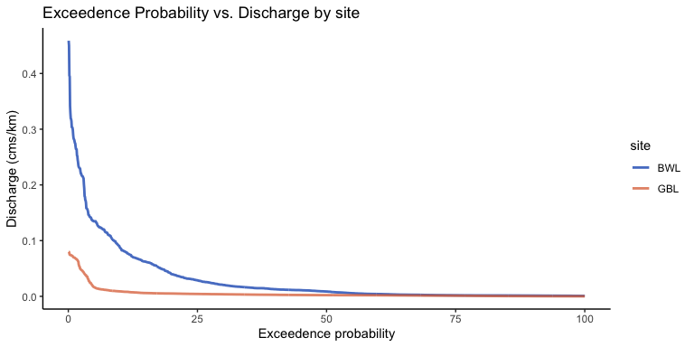
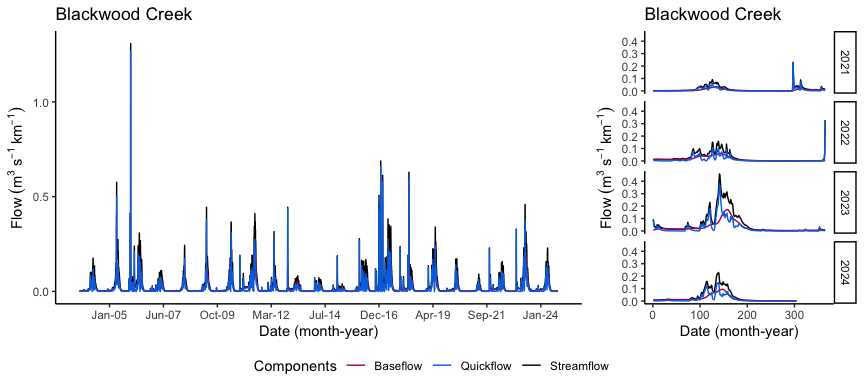
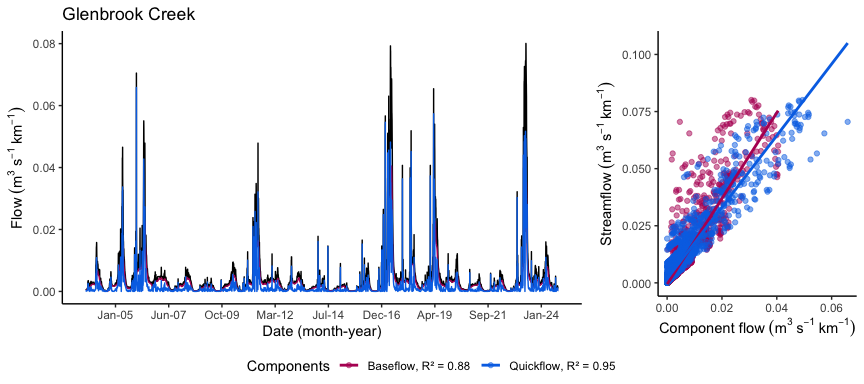
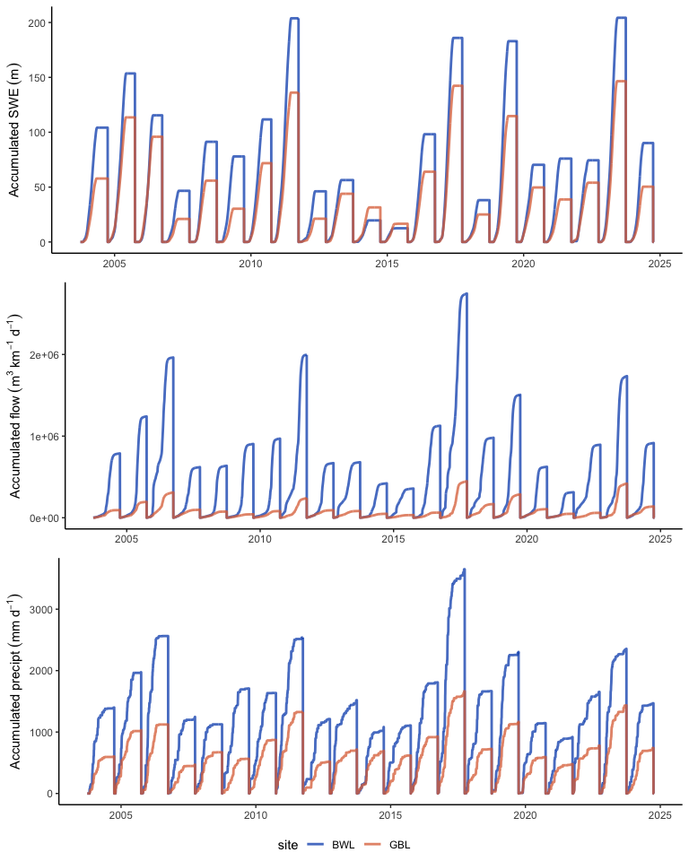
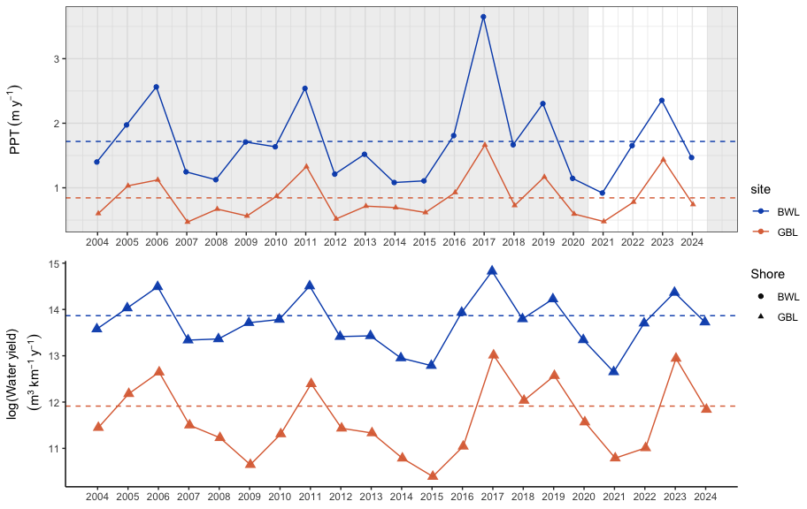

Hydro-climate characteristics
================
Kelly Loria
2026-02-16

<style type="text/css">
body, td {font-size: 13px;}
code.r{font-size: 9px;}
pre {font-size: 11px}
</style>

## Calculating hydrology characteristics for stream flow data

### 1. Flow Duration Analysis

Bring in stream flow to look at snow to flow dynamics from USGS stream
gage network ([streamstats](https://streamstats.usgs.gov/ss/))

### A. Flow Duration Analysis: Estimating flow exceedance probabilities



#### Recap:

Blackwood appears to be flashier relative to glenbrook based on daily
streamflow from 2020-2024.

### B. Baseflow separation based on EcoHydRology baseflow function:

<http://cran.nexr.com/web/packages/EcoHydRology/EcoHydRology.pdf>

#### Estimate baseflow:

### Visualize hydrograph and baseflow components:

##### Plots for Blackwood flow

    ## 
    ## Call:
    ## lm(formula = scale_Q ~ bt, data = flow_data_BW)
    ## 
    ## Residuals:
    ##      Min       1Q   Median       3Q      Max 
    ## -0.12224 -0.00479 -0.00235 -0.00157  1.22777 
    ## 
    ## Coefficients:
    ##              Estimate Std. Error t value Pr(>|t|)    
    ## (Intercept) 0.0010682  0.0004579   2.333   0.0197 *  
    ## bt          1.9247103  0.0147232 130.726   <2e-16 ***
    ## ---
    ## Signif. codes:  0 '***' 0.001 '**' 0.01 '*' 0.05 '.' 0.1 ' ' 1
    ## 
    ## Residual standard error: 0.03391 on 7700 degrees of freedom
    ## Multiple R-squared:  0.6894, Adjusted R-squared:  0.6893 
    ## F-statistic: 1.709e+04 on 1 and 7700 DF,  p-value: < 2.2e-16

    ## 
    ## Call:
    ## lm(formula = scale_Q ~ qft, data = flow_data_BW)
    ## 
    ## Residuals:
    ##      Min       1Q   Median       3Q      Max 
    ## -0.43359 -0.00916 -0.00724  0.00177  0.14247 
    ## 
    ## Coefficients:
    ##              Estimate Std. Error t value Pr(>|t|)    
    ## (Intercept) 0.0106474  0.0002615   40.71   <2e-16 ***
    ## qft         1.3663309  0.0058327  234.25   <2e-16 ***
    ## ---
    ## Signif. codes:  0 '***' 0.001 '**' 0.01 '*' 0.05 '.' 0.1 ' ' 1
    ## 
    ## Residual standard error: 0.02134 on 7700 degrees of freedom
    ## Multiple R-squared:  0.8769, Adjusted R-squared:  0.8769 
    ## F-statistic: 5.487e+04 on 1 and 7700 DF,  p-value: < 2.2e-16



##### Plots for Glenbrook flow

    ## 
    ## Call:
    ## lm(formula = scale_Q ~ bt, data = flow_data_GB)
    ## 
    ## Residuals:
    ##       Min        1Q    Median        3Q       Max 
    ## -0.028446 -0.001035 -0.000124  0.000539  0.062404 
    ## 
    ## Coefficients:
    ##               Estimate Std. Error t value Pr(>|t|)    
    ## (Intercept) -6.325e-04  5.058e-05  -12.51   <2e-16 ***
    ## bt           1.877e+00  1.005e-02  186.86   <2e-16 ***
    ## ---
    ## Signif. codes:  0 '***' 0.001 '**' 0.01 '*' 0.05 '.' 0.1 ' ' 1
    ## 
    ## Residual standard error: 0.003661 on 7700 degrees of freedom
    ## Multiple R-squared:  0.8193, Adjusted R-squared:  0.8193 
    ## F-statistic: 3.492e+04 on 1 and 7700 DF,  p-value: < 2.2e-16

    ## 
    ## Call:
    ## lm(formula = scale_Q ~ qft, data = flow_data_GB)
    ## 
    ## Residuals:
    ##       Min        1Q    Median        3Q       Max 
    ## -0.034488 -0.001468 -0.000432  0.000700  0.034871 
    ## 
    ## Coefficients:
    ##              Estimate Std. Error t value Pr(>|t|)    
    ## (Intercept) 1.789e-03  3.566e-05   50.18   <2e-16 ***
    ## qft         1.567e+00  6.494e-03  241.31   <2e-16 ***
    ## ---
    ## Signif. codes:  0 '***' 0.001 '**' 0.01 '*' 0.05 '.' 0.1 ' ' 1
    ## 
    ## Residual standard error: 0.002943 on 7700 degrees of freedom
    ## Multiple R-squared:  0.8832, Adjusted R-squared:  0.8832 
    ## F-statistic: 5.823e+04 on 1 and 7700 DF,  p-value: < 2.2e-16



## 2. Hydro-climate characterization

Major question to address:

- How do the watersheds filter surface water inputs to streams based on
  differences in local climate (precipitation events, snow-accumulation
  and snow-melt)?

##### Function for water year:

``` r
# fxn for water year
water_year <- function(data) {
  data %>%
    mutate(date = ymd(date)) %>%
    mutate(WaterYear = if_else(month(date) >= 10, year(date) + 1, year(date)))
}
```

##### Read in data from SNOTEL

    ##   site_name            site_id           date            snow_water_equivalent
    ##  Length:15360       Min.   :615.0   Min.   :2003-10-01   Min.   :   0.0       
    ##  Class :character   1st Qu.:615.0   1st Qu.:2009-01-01   1st Qu.:   0.0       
    ##  Mode  :character   Median :731.5   Median :2014-04-05   Median :  17.8       
    ##                     Mean   :731.5   Mean   :2014-04-05   Mean   : 224.0       
    ##                     3rd Qu.:848.0   3rd Qu.:2019-07-08   3rd Qu.: 342.9       
    ##                     Max.   :848.0   Max.   :2024-10-09   Max.   :1785.6       
    ##                                                                               
    ##  precipitation_cumulative temperature_max  temperature_min    temperature_mean  precipitation    
    ##  Min.   :   0.0           Min.   :-15.50   Min.   :-28.5000   Min.   :-17.800   Min.   :  0.000  
    ##  1st Qu.: 332.7           1st Qu.:  5.90   1st Qu.: -5.2000   1st Qu.: -0.300   1st Qu.:  0.000  
    ##  Median : 688.3           Median : 12.70   Median : -0.7000   Median :  4.700   Median :  0.000  
    ##  Mean   : 847.2           Mean   : 12.72   Mean   : -0.6658   Mean   :  5.354   Mean   :  3.503  
    ##  3rd Qu.:1186.8           3rd Qu.: 20.20   3rd Qu.:  4.6000   3rd Qu.: 11.900   3rd Qu.:  0.000  
    ##  Max.   :3650.0           Max.   : 31.70   Max.   : 15.9000   Max.   : 21.600   Max.   :292.100  
    ##                           NA's   :12       NA's   :16         NA's   :13        NA's   :1        
    ##    WaterYear        site          
    ##  Min.   :2004   Length:15360      
    ##  1st Qu.:2009   Class :character  
    ##  Median :2014   Mode  :character  
    ##  Mean   :2014                     
    ##  3rd Qu.:2019                     
    ##  Max.   :2025                     
    ## 

## B. Melt and stream flow.

<!-- -->

### Estimate values for:

- Total accumulated SWE per water year in mm/yr

- Water yield (cms/km yr)

- Max SWE measurement mm

- Max precipitation accumulation (ppt) in mm

``` r
snowflow_dat_sum <- snowflow_dat%>%
  filter(WaterYear<2025) %>%
  group_by(site, WaterYear) %>%
  summarise(Total_SWE = max(accum_SWE, na.rm=T),
            Water_yield = max(accum_Qm3D, na.rm = T),
            Max_SWE = max(snow_water_equivalent, na.rm=T),
            Total_ppt = max(precipitation_cumulative, na.rm=T),
            scale_pk_Q = max(scale_Q, na.rm = T)
            )

summary(snowflow_dat_sum)
```

    ##      site             WaterYear      Total_SWE       Water_yield         Max_SWE      
    ##  Length:42          Min.   :2004   Min.   : 12530   Min.   :  32595   Min.   : 149.9  
    ##  Class :character   1st Qu.:2009   1st Qu.: 44505   1st Qu.:  95026   1st Qu.: 464.2  
    ##  Mode  :character   Median :2014   Median : 71070   Median : 387785   Median : 640.0  
    ##                     Mean   :2014   Mean   : 81932   Mean   : 600482   Mean   : 809.2  
    ##                     3rd Qu.:2019   3rd Qu.:113069   3rd Qu.: 901210   3rd Qu.:1085.2  
    ##                     Max.   :2024   Max.   :204311   Max.   :2746784   Max.   :1785.6  
    ##    Total_ppt        scale_pk_Q      
    ##  Min.   : 469.9   Min.   :0.004522  
    ##  1st Qu.: 730.2   1st Qu.:0.015848  
    ##  Median :1135.3   Median :0.079671  
    ##  Mean   :1281.0   Mean   :0.199181  
    ##  3rd Qu.:1649.1   3rd Qu.:0.306031  
    ##  Max.   :3650.0   Max.   :1.308077

``` r
### get 20 year water year averages
snowflow_HA <- snowflow_dat_sum%>%
  filter(WaterYear<2025) %>%
  group_by(site) %>%
  summarise(mean_SWE_acc = mean(Total_SWE, na.rm=T),
            mean_Water_yield = mean(Water_yield, na.rm = T),
            mean_SWE = mean(Max_SWE, na.rm = T),
            mean_ppt_acc = mean(Total_ppt, na.rm = T)
            )

snowflow_HA
```

    ## # A tibble: 2 × 5
    ##   site  mean_SWE_acc mean_Water_yield mean_SWE mean_ppt_acc
    ##   <chr>        <dbl>            <dbl>    <dbl>        <dbl>
    ## 1 BWL         98089.         1051794.     974.        1718.
    ## 2 GBL         65774.          149169.     644.         844.

``` r
snowflow_HA1 <- snowflow_dat_sum%>%
  filter(WaterYear>2020 & WaterYear<2024) %>%
  mutate(WY_lab = case_when(
    WaterYear %in% c(2021, 2022) ~ "dry",
    WaterYear %in% c(2023) ~ "wet",
    TRUE ~ NA_character_  )) %>%
    group_by(site,WY_lab) %>%
  summarise(mean_SWE_acc = mean(Total_SWE, na.rm=T),
            mean_Water_yield = mean(Water_yield, na.rm = T),
            mean_SWE = mean(Max_SWE, na.rm = T),
            mean_ppt_acc = mean(Total_ppt, na.rm = T),
            m_pk_Q= mean(scale_pk_Q, na.rm=T)
            )

snowflow_HA1
```

    ## # A tibble: 4 × 7
    ## # Groups:   site [2]
    ##   site  WY_lab mean_SWE_acc mean_Water_yield mean_SWE mean_ppt_acc  m_pk_Q
    ##   <chr> <chr>         <dbl>            <dbl>    <dbl>        <dbl>   <dbl>
    ## 1 BWL   dry          75219.          603300.     729.        1286. 0.160  
    ## 2 BWL   wet         204311.         1734968.    1786.        2355. 0.459  
    ## 3 GBL   dry          46391.           54486.     423.         629. 0.00696
    ## 4 GBL   wet         146517.          417723.    1364         1435. 0.0801

<!-- -->

## A. Calculate delta SWE

Functions to identify max SWE per site for each water year and last day
of snow pack persistence.

    ## # A tibble: 8 × 4
    ##   site  WaterYear transition_to_zero  trans_day_of_year
    ##   <chr>     <dbl> <dttm>                          <dbl>
    ## 1 BWL        2021 2021-05-13 00:00:00               133
    ## 2 BWL        2022 2022-05-24 00:00:00               144
    ## 3 BWL        2023 2023-06-20 00:00:00               171
    ## 4 BWL        2024 2024-06-01 00:00:00               153
    ## 5 GBL        2021 2021-05-12 00:00:00               132
    ## 6 GBL        2022 2022-05-23 00:00:00               143
    ## 7 GBL        2023 2023-06-15 00:00:00               166
    ## 8 GBL        2024 2024-05-28 00:00:00               149

End of script.
