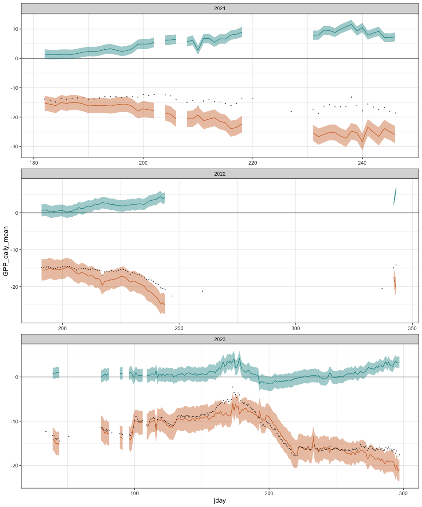
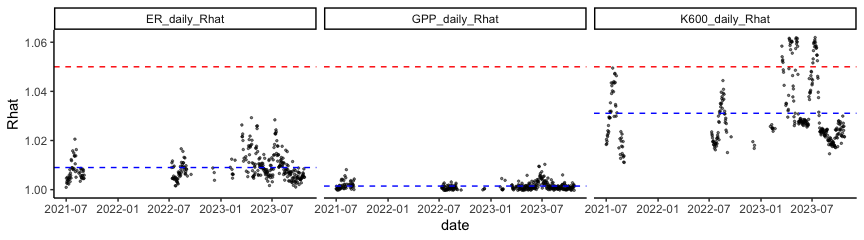
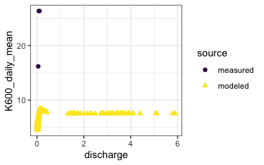
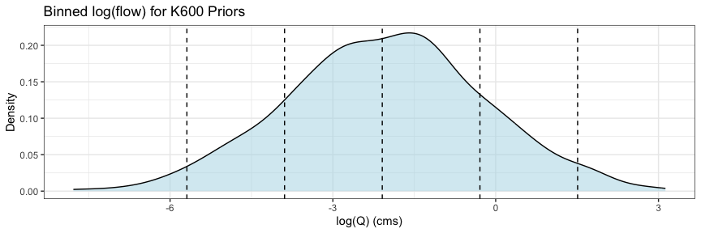
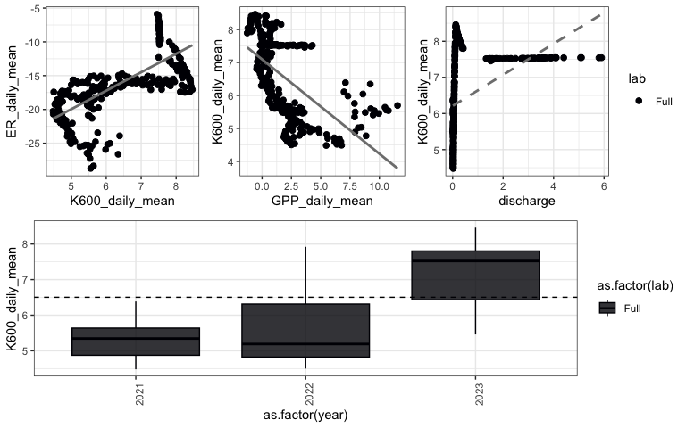
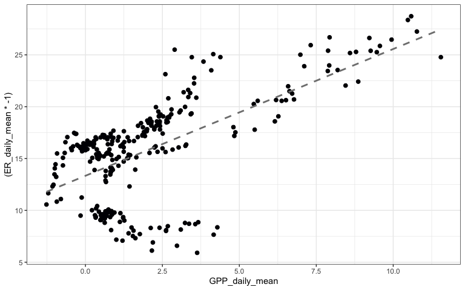
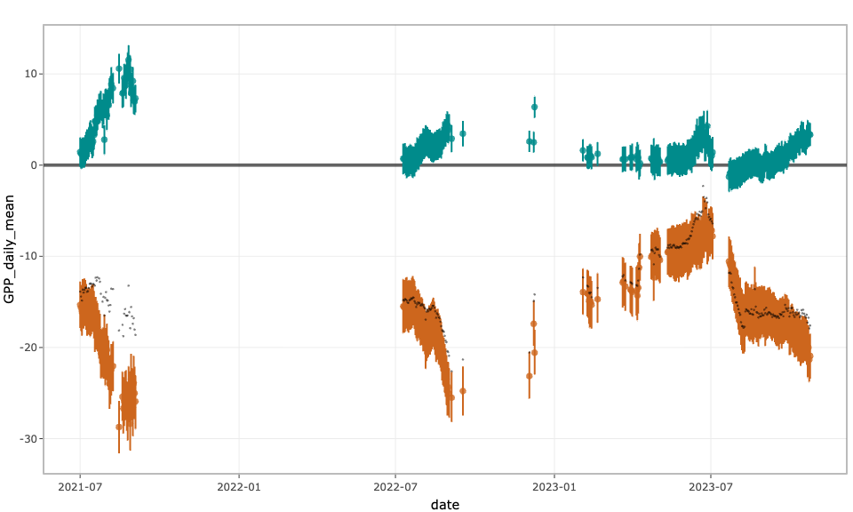
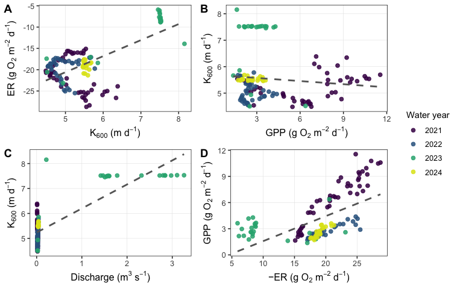

Streammetabolizer output for BWU
================
Kelly Loria
2025-02-04

- [Background](#background)
- [Metabolism with CIs for the full time
  series](#metabolism-with-cis-for-the-full-time-series)
- [Checking full model convergence](#checking-full-model-convergence)
- [Compared modeled and measured
  K600](#compared-modeled-and-measured-k600)
- [Full run with binned K600 informed by both measured and modeled
  priors](#full-run-with-binned-k600-informed-by-both-measured-and-modeled-priors)
- [Final cleaned model output:](#final-cleaned-model-output)
- [Table summarizing excluded data from cleaned model
  output:](#table-summarizing-excluded-data-from-cleaned-model-output)

<style type="text/css">
body, td {font-size: 12px;}
code.r{font-size: 8px;}
pre {font-size: 10px}
</style>

### Background

This is the **upper** reach of the larger turbulent mountain stream,
Blackwood Creek in CA, USA.

#### Identifying reasonable modeled estimates of K600

We then ran the normal stream metabolizer model:
`b_Kb_oipi_tr_plrckm.stan` to get modeled K600 to see if we could
resolve the negative correlation between ER and K600. Priors on
`K600_lnQ_nodes_meanlog` were set as 5 bins based on
`rnorm(1000, mean = logQ_mean, sd = logQ_sd)` centered around the mean
and logQ values 1-2 sd away from the mean.

##### Load different model segments with normal prior for gas exchange.

We chose segments of time where we believe GPP occurred and was greater
than 0. These chunks of time are from a previous model where we binned
flow and incorporated measured and estimated K600 priors from gas
exchange measurements a the reach.

### Metabolism with CIs for the full time series

This the raw model output. It looks okay aside from some small parts of
2023. Where GPP is in blue and ER is in orange, and the black points
represent NEP.

**Here is the run configuration for full model:**

`mm_name(type = 'bayes', pool_K600 = "binned", err_obs_iid = TRUE, err_proc_iid = TRUE, ode_method = "trapezoid", deficit_src = 'DO_mod', engine = 'stan')`

**Fitting priors:**

`K600_lnQ_nodes_meanlog = log(16)` Where 16 was the mean value from
observed measurements and normal pooled modeled,
`K600_lnQ_nodes_sdlog = 1.31`
`bayes_specs_new$K600_lnQ_nodes_centers <- log_bins` was from
`prior_samples <- rnorm(1000, mean = logQ_mean, sd = logQ_sd)`

<!-- -->

### Checking full model convergence

Make sure the chains converged; all r-hat values were well below 1.05
(the red line) for GPP, ER, and K600. The blue lines are the mean for
each parameter.

\*\* Some poor convergence in 2023 for K600

Looks like that weird 2023 time period corresponds to bad rhats for all
parameters.

``` r
k600.rhat <- mean(na.omit(met.full$K600_daily_Rhat))
k600.rhat
```

    ## [1] 1.031087

``` r
GPP.rhat <- mean(na.omit(met.full$GPP_Rhat))
GPP.rhat
```

    ## [1] 1.00146

``` r
ER.rhat <- mean(na.omit(met.full$ER_Rhat))
ER.rhat
```

    ## [1] 1.009003

<!-- -->

    ##       date                lab                 rmse               sd         
    ##  Min.   :2021-06-30   Length:878         Min.   :0.02083   Min.   :0.01382  
    ##  1st Qu.:2022-08-20   Class :character   1st Qu.:0.07834   1st Qu.:0.17891  
    ##  Median :2023-03-20   Mode  :character   Median :0.13704   Median :0.29896  
    ##  Mean   :2022-12-22                      Mean   :0.21172   Mean   :0.38858  
    ##  3rd Qu.:2023-07-07                      3rd Qu.:0.22885   3rd Qu.:0.44737  
    ##  Max.   :2023-10-25                      Max.   :1.21353   Max.   :1.81638  
    ##                                          NA's   :216                        
    ##       min             max             range             nrmse        
    ##  Min.   :3.751   Min.   : 4.501   Min.   :0.04433   Min.   :0.03904  
    ##  1st Qu.:4.639   1st Qu.: 6.527   1st Qu.:0.58433   1st Qu.:0.12631  
    ##  Median :6.053   Median : 7.169   Median :0.92533   Median :0.17711  
    ##  Mean   :6.497   Mean   : 7.742   Mean   :1.24528   Mean   :0.17293  
    ##  3rd Qu.:8.826   3rd Qu.: 9.424   3rd Qu.:1.46575   3rd Qu.:0.21938  
    ##  Max.   :9.630   Max.   :11.714   Max.   :5.52167   Max.   :0.32598  
    ##                                                     NA's   :216      
    ##       minT             maxT            rangeT       
    ##  Min.   : 1.003   Min.   : 1.148   Min.   :0.04733  
    ##  1st Qu.: 1.905   1st Qu.: 5.092   1st Qu.:2.84900  
    ##  Median : 7.727   Median :12.144   Median :4.46433  
    ##  Mean   : 6.440   Mean   :10.962   Mean   :4.52220  
    ##  3rd Qu.: 9.363   3rd Qu.:15.943   3rd Qu.:6.19533  
    ##  Max.   :12.763   Max.   :18.173   Max.   :9.31633  
    ## 

### Compared modeled and measured K600

Plots for (1) measured v modeled K600 and flow and (2) logK600 and
log(flow+1).

Could be one poor measurement at the highest flow for measured gas
exchange. But in general the modeled K600 does seem similar to the
measured, which is kind of nice to see how robust the
`pool_K600 = "normal"` is getting at K600.

``` r
met.clean <- met.full %>%
  filter(GPP_daily_Rhat<1.05)%>%
  filter(GPP_97.5pct>0)%>%
  filter(ER_daily_Rhat<1.05) %>%
  filter(ER_2.5pct<0)%>%
  filter(K600_daily_Rhat<1.05) %>%
  filter(K600_daily_mean<45)

mean_k_mod <- mean(met.clean$K600_daily_mean)
mean_k_mod
```

    ## [1] 6.503293

``` r
mean_k_measure <- mean(measured_K$K600)
mean_k_measure
```

    ## [1] 22.96813

``` r
KER_cor <- round(cor(met.clean$ER_daily_mean, met.clean$K600_daily_mean, use = "complete.obs"),3)
print(KER_cor)
```

    ## [1] 0.686

``` r
KGPP_cor <-round(cor(met.clean$GPP_daily_mean, met.clean$K600_daily_mean, use = "complete.obs"),3)
print(KGPP_cor)
```

    ## [1] -0.587



### Full run with binned K600 informed by both measured and modeled priors

**Here is the run configuration for full model:**

`mm_name(type = 'bayes', pool_K600 = "binned", err_obs_iid = TRUE, err_proc_iid = TRUE, ode_method = "trapezoid", deficit_src = 'DO_mod', engine = 'stan')`

#### Quick plot of flow bins given flow range:

Where dashed vertical lines correspond to the prior locations for flow
bins in `bayes_specs_new$K600_lnQ_nodes_centers <- log_bins`



Plots made on filtered data: **`met.clean`** filtered for days with
`GPP_daily_Rhat<1.05`,`ER_daily_Rhat<1.05`, `K600_daily_Rhat <1.05`, as
well as `(GPP_97.5pct>0)` and `(ER_2.5pct<0)`.



The vertical dashed is the overall mean modeled K600 in the box plot.

##### GPP and ER ?

    ## [1] -0.629



The direction of the K600 ~ flow relationship looks more logical, where
K600 increases with flow. ER and K600 are positively correlated (0.686),
GPP and K600 are negatively correlated (-0.587). but, less strongly
relative to the lower reach (GBL). The relationship between K600 and
flow appears to be positive but still inflected in a strange way.

However I’m still think we should be cautious in over interpreting ER
trends.

The mean modeled K600 is lower than expected, 6.50 when it should be
closer to 16.

### Final cleaned model output:

Where GPP is in blue and ER is in orange, and the black points represent
NEP.

<!-- -->

### Table summarizing excluded data from cleaned model output:

<table class="table" style="font-size: 15px; margin-left: auto; margin-right: auto;">
<thead>
<tr>
<th style="text-align:left;font-weight: bold;font-size: 16px;">
Metric
</th>
<th style="text-align:right;font-weight: bold;font-size: 16px;">
Number of Days
</th>
<th style="text-align:right;font-weight: bold;font-size: 16px;">
Percent of FULL DO days
</th>
</tr>
</thead>
<tbody>
<tr>
<td style="text-align:left;">
Total DO days (FULL: \>= 48 half-hour intervals)
</td>
<td style="text-align:right;">
431
</td>
<td style="text-align:right;">
100.0
</td>
</tr>
<tr>
<td style="text-align:left;">
Days with ANY metabolism output (on full DO days)
</td>
<td style="text-align:right;">
331
</td>
<td style="text-align:right;">
76.8
</td>
</tr>
<tr>
<td style="text-align:left;">
Days with NO metabolism output (on full DO days)
</td>
<td style="text-align:right;">
100
</td>
<td style="text-align:right;">
23.2
</td>
</tr>
<tr>
<td style="text-align:left;">
Days with CLEAN metabolism (GPP+ER+K600 all pass)
</td>
<td style="text-align:right;">
130
</td>
<td style="text-align:right;">
30.2
</td>
</tr>
<tr>
<td style="text-align:left;">
Days with CLEAN GPP (Rhat\<=1.05 & GPP_2.5pct\>=0)
</td>
<td style="text-align:right;">
130
</td>
<td style="text-align:right;">
30.2
</td>
</tr>
<tr>
<td style="text-align:left;">
Days with CLEAN ER (Rhat\<=1.05 & ER_97.5pct\<=0)
</td>
<td style="text-align:right;">
331
</td>
<td style="text-align:right;">
76.8
</td>
</tr>
<tr>
<td style="text-align:left;">
Days with CLEAN K600 (Rhat\<=1.05)
</td>
<td style="text-align:right;">
291
</td>
<td style="text-align:right;">
67.5
</td>
</tr>
<tr>
<td style="text-align:left;">
Days with UNREASONABLE GPP (Rhat\>1.05 & GPP_97.5pct\<0)
</td>
<td style="text-align:right;">
0
</td>
<td style="text-align:right;">
0.0
</td>
</tr>
<tr>
<td style="text-align:left;">
Days with UNREASONABLE ER (Rhat\>1.05 & ER_2.5pct\>0)
</td>
<td style="text-align:right;">
0
</td>
<td style="text-align:right;">
0.0
</td>
</tr>
<tr>
<td style="text-align:left;">
Days with poor K600 (Rhat\>1.05)
</td>
<td style="text-align:right;">
40
</td>
<td style="text-align:right;">
9.3
</td>
</tr>
</tbody>
</table>

``` r
new_df_clean <- met_class %>%
  filter(clean_all==T)

KER_cor <- round(cor(new_df_clean$ER_daily_mean, new_df_clean$K600_daily_mean, use = "complete.obs"),3)
print(KER_cor)
```

    ## [1] 0.658

``` r
KGPP_cor <-round(cor(new_df_clean$GPP_daily_mean, new_df_clean$K600_daily_mean, use = "complete.obs"),3)
print(KGPP_cor)
```

    ## [1] -0.109

``` r
GPP_ER_cor <-round(cor(new_df_clean$GPP_daily_mean, (new_df_clean$ER_daily_mean*-1), use = "complete.obs"),3)
print(GPP_ER_cor)
```

    ## [1] 0.593



#### Session info

**R version 4.4.2 (2024-10-31)**

**Platform:** aarch64-apple-darwin20

**locale:**
en_US.UTF-8\|\|en_US.UTF-8\|\|en_US.UTF-8\|\|C\|\|en_US.UTF-8\|\|en_US.UTF-8

**attached base packages:** *stats*, *graphics*, *grDevices*, *utils*,
*datasets*, *methods* and *base*

**other attached packages:** *plotly(v.4.10.4)*, *kableExtra(v.1.4.0)*,
*knitr(v.1.50)*, *streamMetabolizer(v.0.12.1)*, *ggpubr(v.0.6.0)*,
*readxl(v.1.4.3)*, *zoo(v.1.8-12)*, *cowplot(v.1.1.3)*,
*viridis(v.0.6.5)*, *viridisLite(v.0.4.2)*, *dataRetrieval(v.2.7.17)*,
*lubridate(v.1.9.4)*, *forcats(v.1.0.0)*, *stringr(v.1.5.1)*,
*dplyr(v.1.1.4)*, *purrr(v.1.1.0)*, *readr(v.2.1.5)*, *tidyr(v.1.3.1)*,
*tibble(v.3.3.0)*, *ggplot2(v.3.5.2)* and *tidyverse(v.2.0.0)*

**loaded via a namespace (and not attached):** *DBI(v.1.2.3)*,
*gridExtra(v.2.3)*, *rlang(v.1.1.6)*, *magrittr(v.2.0.3)*,
*e1071(v.1.7-16)*, *compiler(v.4.4.2)*, *mgcv(v.1.9-1)*,
*systemfonts(v.1.1.0)*, *vctrs(v.0.6.5)*, *pkgconfig(v.2.0.3)*,
*crayon(v.1.5.3)*, *fastmap(v.1.2.0)*, *backports(v.1.5.0)*,
*labeling(v.0.4.3)*, *pander(v.0.6.5)*, *promises(v.1.3.2)*,
*deSolve(v.1.40)*, *rmarkdown(v.2.29)*, *tzdb(v.0.4.0)*, *ps(v.1.9.1)*,
*bit(v.4.5.0.1)*, *xfun(v.0.53)*, *jsonlite(v.2.0.0)*, *later(v.1.4.1)*,
*broom(v.1.0.7)*, *parallel(v.4.4.2)*, *R6(v.2.6.1)*,
*stringi(v.1.8.7)*, *RColorBrewer(v.1.1-3)*, *car(v.3.1-3)*,
*cellranger(v.1.1.0)*, *Rcpp(v.1.1.0)*, *Matrix(v.1.7-1)*,
*splines(v.4.4.2)*, *timechange(v.0.3.0)*, *tidyselect(v.1.2.1)*,
*rstudioapi(v.0.17.1)*, *dichromat(v.2.0-0.1)*, *abind(v.1.4-8)*,
*yaml(v.2.3.10)*, *websocket(v.1.4.4)*, *processx(v.3.8.6)*,
*lattice(v.0.22-6)*, *plyr(v.1.8.9)*, *withr(v.3.0.2)*,
*evaluate(v.1.0.5)*, *rLakeAnalyzer(v.1.11.4.1)*, *sf(v.1.0-21)*,
*units(v.0.8-7)*, *proxy(v.0.4-27)*, *xml2(v.1.4.0)*,
*pillar(v.1.11.0)*, *carData(v.3.0-5)*, *KernSmooth(v.2.23-24)*,
*generics(v.0.1.4)*, *vroom(v.1.6.5)*, *chromote(v.0.5.1)*,
*hms(v.1.1.3)*, *scales(v.1.4.0)*, *class(v.7.3-22)*, *glue(v.1.8.0)*,
*lazyeval(v.0.2.2)*, *tools(v.4.4.2)*, *webshot2(v.0.1.2)*,
*data.table(v.1.16.4)*, *webshot(v.0.5.5)*, *ggsignif(v.0.6.4)*,
*LakeMetabolizer(v.1.5.5)*, *grid(v.4.4.2)*, *crosstalk(v.1.2.2)*,
*nlme(v.3.1-166)*, *Formula(v.1.2-5)*, *cli(v.3.6.5)*,
*svglite(v.2.1.3)*, *gtable(v.0.3.6)*, *rstatix(v.0.7.2)*,
*digest(v.0.6.37)*, *classInt(v.0.4-11)*, *htmlwidgets(v.1.6.4)*,
*farver(v.2.1.2)*, *htmltools(v.0.5.8.1)*, *lifecycle(v.1.0.4)*,
*httr(v.1.4.7)*, *unitted(v.0.2.9)* and *bit64(v.4.5.2)*
