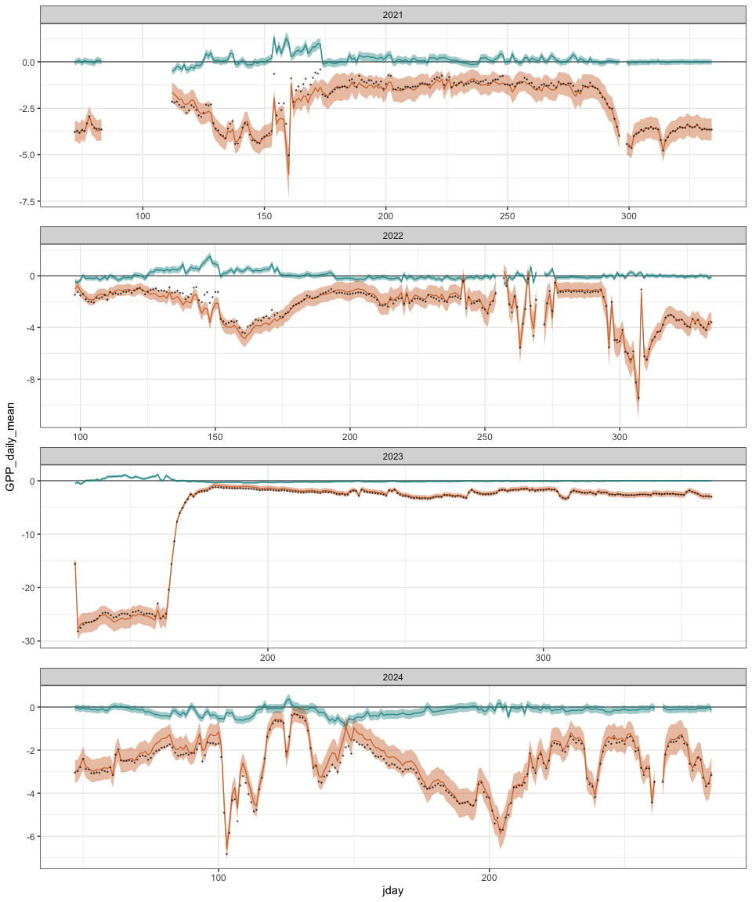
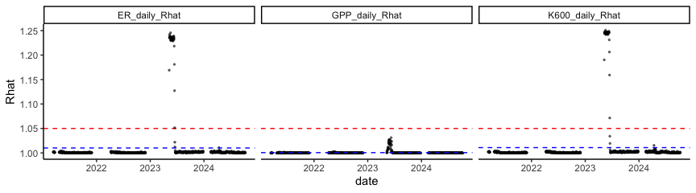
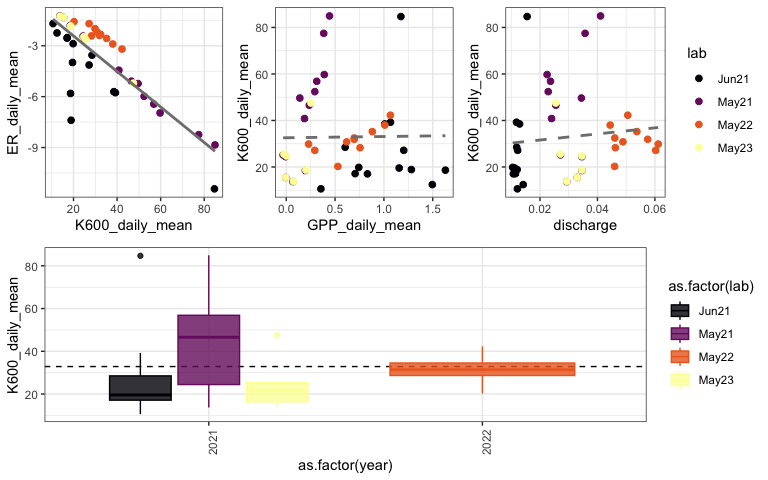
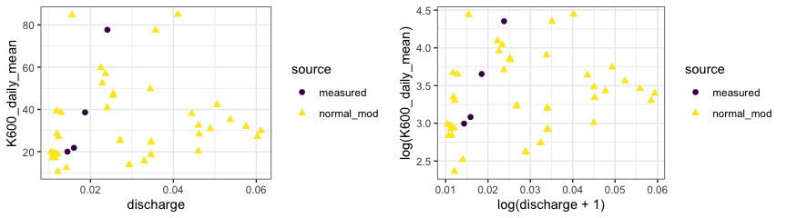
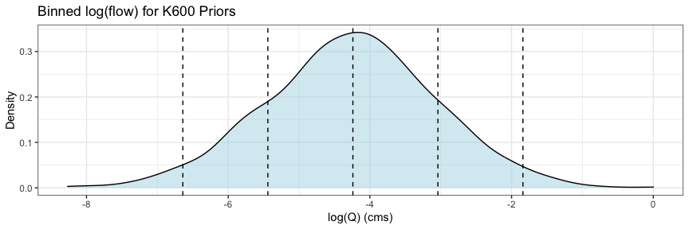
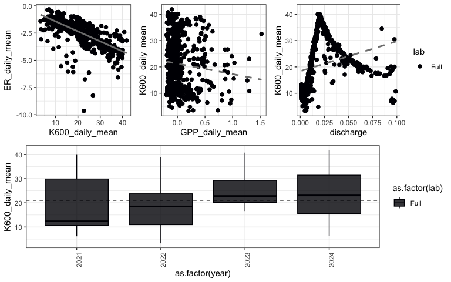
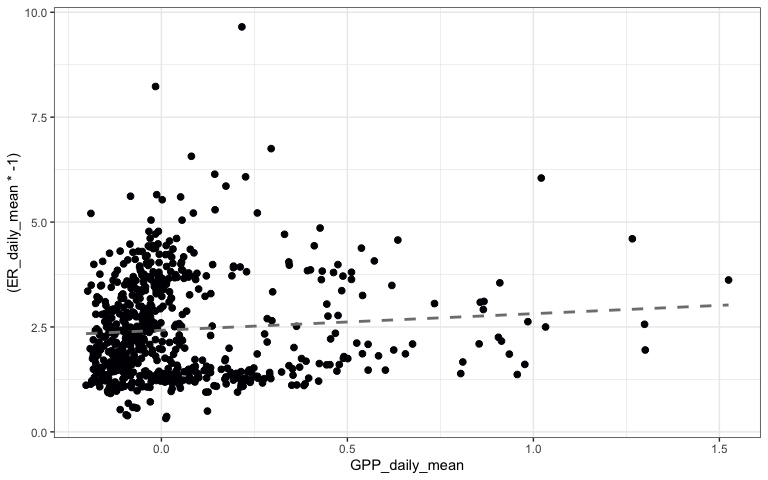
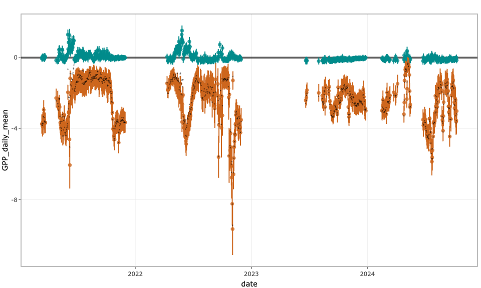
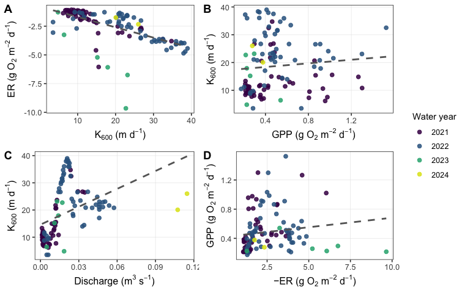

Streammetabolizer output for GBU on 30 minute aggregated obs
================
Kelly Loria
2025-03-18

- [Background](#background)
- [Metabolism with CIs for the full time
  series](#metabolism-with-cis-for-the-full-time-series)
- [Checking full model convergence](#checking-full-model-convergence)
- [Looking at the estimated K600 and ER relationships from normal
  pooling](#looking-at-the-estimated-k600-and-er-relationships-from-normal-pooling)
- [Compared modeled and measured
  K600](#compared-modeled-and-measured-k600)
- [Full run with binned K600 informed by both measured and modeled
  priors](#full-run-with-binned-k600-informed-by-both-measured-and-modeled-priors)
- [Final thoughts.](#final-thoughts)
  - [Final cleaned model output:](#final-cleaned-model-output)
  - [Table summarizing excluded data from cleaned model
    output:](#table-summarizing-excluded-data-from-cleaned-model-output)

<style type="text/css">
body, td {font-size: 12px;}
code.r{font-size: 8px;}
pre {font-size: 10px}
</style>

### Background

This is the **upper** reach of a small, turbulent, shaded, stream with a
fair amount of fine particulate organic matter.

#### Identifying reasonable modeled estimates of K600

We then ran the normal stream metabolizer model:
`b_Kb_oipi_tr_plrckm.stan` to get modeled K600 to see if we could
resolve the negative correlation between ER and K600. Priors on
`K600_lnQ_nodes_meanlog` were set as 5 bins based on
`rnorm(1000, mean = logQ_mean, sd = logQ_sd)` centered around the mean
and logQ va;ues 1-2 sd away from the mean.

#### Load different model segments with normal prior for gas exchange.

We chose segments of time where we believe GPP occurred and was greater
than 0. These chunks of time are from a previous model where we binned
flow and incorporated measured and estimated K600 priors from gas
exchange measurements a the reach.

### Metabolism with CIs for the full time series

This the raw model output. It looks okay aside from that part of 2023
where ER strangely dips. Where GPP is in blue and ER is in orange.

**Here is the run configuration for full model:**

`mm_name(type = 'bayes', pool_K600 = "binned", err_obs_iid = TRUE, err_proc_iid = TRUE, ode_method = "trapezoid", deficit_src = 'DO_mod', engine = 'stan')`

**Fitting priors:**

`K600_lnQ_nodes_meanlog = log(32)` Where 32 was the mean value from
observed measurements and normal pooled modeled,
`K600_lnQ_nodes_sdlog = 1.2` was 1.2,
`bayes_specs_new$K600_lnQ_nodes_centers <- log_bins` was from
`prior_samples <- rnorm(1000, mean = logQ_mean, sd = logQ_sd)`

<!-- -->

### Checking full model convergence

Make sure the chains converged; all r-hat values were well below 1.05
(the red line) for GPP, ER, and K600. The blue lines are the mean for
each parameter.

\*\* Not all all segments had great convergence.

Looks like that weird 2023 time period corresponds to bad rhats for all
parameters.

    ## [1] 1.01086

    ## [1] 1.00055

    ## [1] 1.010075

<!-- -->

    ##       date                lab                 rmse               sd         
    ##  Min.   :2021-05-01   Length:120         Min.   :0.02600   Min.   :0.08183  
    ##  1st Qu.:2021-05-08   Class :character   1st Qu.:0.05183   1st Qu.:0.36078  
    ##  Median :2021-05-23   Mode  :character   Median :0.09201   Median :0.43503  
    ##  Mean   :2021-08-15                      Mean   :0.11585   Mean   :0.42122  
    ##  3rd Qu.:2021-09-03                      3rd Qu.:0.13302   3rd Qu.:0.46960  
    ##  Max.   :2022-05-15                      Max.   :0.43387   Max.   :0.75359  
    ##                                          NA's   :16                         
    ##       min             max             range            nrmse        
    ##  Min.   :6.022   Min.   : 7.802   Min.   :0.2227   Min.   :0.02340  
    ##  1st Qu.:7.430   1st Qu.: 8.801   1st Qu.:1.2165   1st Qu.:0.03977  
    ##  Median :7.738   Median : 9.033   Median :1.3600   Median :0.06643  
    ##  Mean   :7.773   Mean   : 9.143   Mean   :1.3699   Mean   :0.07587  
    ##  3rd Qu.:8.190   3rd Qu.: 9.479   3rd Qu.:1.5277   3rd Qu.:0.10308  
    ##  Max.   :9.612   Max.   :10.815   Max.   :2.8733   Max.   :0.18608  
    ##                                                    NA's   :16       
    ##       minT             maxT           rangeT     
    ##  Min.   : 1.790   Min.   : 5.53   Min.   :0.525  
    ##  1st Qu.: 5.617   1st Qu.:11.55   1st Qu.:5.524  
    ##  Median : 6.961   Median :12.90   Median :6.033  
    ##  Mean   : 6.966   Mean   :12.72   Mean   :5.750  
    ##  3rd Qu.: 8.165   3rd Qu.:14.25   3rd Qu.:6.559  
    ##  Max.   :11.603   Max.   :17.25   Max.   :8.051  
    ## 

### Looking at the estimated K600 and ER relationships from normal pooling

**Here is the run configuration to get modeled K600:**

`mm_name(type = 'bayes', pool_K600 = "normal", err_obs_iid = TRUE, err_proc_iid = TRUE, ode_method = "trapezoid", deficit_src = 'DO_mod', engine = 'stan')`

Where each “lab” segment was run as individual model with the
`K600_lnQ_nodes_meanlog` adjusted to match streamline in cms during that
time.

#### K-ER, K-Q, general K600 trends from segements with GPP \> 0

There is a strong negative correlation between ER and K600 (-0.828). GPP
and K600 are slightly less correlated (0.013). And Likely a positive
relationship between flow and K600.

``` r
mean_k_mod <- mean(met.df$K600_daily_mean)
mean_k_mod
```

    ## [1] 32.85907

``` r
mean_k_measure <- mean(measured_K$K600)
mean_k_measure
```

    ## [1] 39.53105

``` r
possibleK <- (mean_k_mod + mean_k_measure)/2
possibleK
```

    ## [1] 36.19506

``` r
KER_cor <- round(cor(met.df$ER_daily_mean, met.df$K600_daily_mean, use = "complete.obs"),3)
print(KER_cor)
```

    ## [1] -0.828

``` r
KGPP_cor <-round(cor(met.df$GPP_daily_mean, met.df$K600_daily_mean, use = "complete.obs"),3)
print(KGPP_cor)
```

    ## [1] 0.013



The vertical dashed is the overall mean modeled K600 in the box plot.

### Compared modeled and measured K600

Plots for (1) measured v modeled K600 and flow and (2) logK600 and
log(flow+1).

Could be one poor measurement at the highest flow for measured gas
exchange. But in general the modeled K600 does seem similar to the
measured, which is kind of nice to see how robust the
`pool_K600 = "normal"` is getting at K600.



### Full run with binned K600 informed by both measured and modeled priors

**Here is the run configuration for full model:**

`mm_name(type = 'bayes', pool_K600 = "binned", err_obs_iid = TRUE, err_proc_iid = TRUE, ode_method = "trapezoid", deficit_src = 'DO_mod', engine = 'stan')`

``` r
dat1 <- input_dat%>% filter(discharge<0.099) 
## Set bayes specs
bayes_name_new <- mm_name(type = 'bayes', pool_K600 = "binned",
                          err_obs_iid = TRUE, err_proc_iid = TRUE,
                          ode_method = "trapezoid", deficit_src = 'DO_mod', engine = 'stan')
bayes_specs_new <- specs(bayes_name_new)

# Compute log-transformed discharge
logQ <- log(na.omit(dat1$discharge))
sd_logQ <- round(sd(na.omit(logQ)),2)


## Compute log-transformed K600 for prior estimation
logQ_mean <- round(mean(logQ, na.rm = TRUE),2)  # Center the prior flow mean
logQ_mean
```

    ## [1] -4.24

``` r
logQ_sd <- round(c(sd(logQ, na.rm = TRUE)),1)  # Double the SD for a wider prior
logQ_sd
```

    ## [1] 1.2

``` r
logK600_mean <- round(log(32),1)  # Center the prior on mean k600
logK600_mean
```

    ## [1] 3.5

``` r
logK600_sd <- round(c(log(81/32)),2)  # Double the SD for a wider prior
logK600_sd
```

    ## [1] 0.93

``` r
range_prior_U <- exp(logK600_mean +logK600_sd)
range_prior_U
```

    ## [1] 83.93142

``` r
range_prior_L <- exp(logK600_mean -logK600_sd)
range_prior_L
```

    ## [1] 13.06582

``` r
prior_samples <- rnorm(1000, mean = logQ_mean, sd = logQ_sd)
# Define bins based on log-scale mean and SD
log_bins <- c(logQ_mean - c(2 * logQ_sd), 
              logQ_mean - c(1 * logQ_sd), 
              logQ_mean, 
              logQ_mean + c(1 * logQ_sd), 
              logQ_mean + c(2 * logQ_sd))

# Plot:
#bins <- exp(log_bins)
prior_df <- data.frame(Q_cms = prior_samples)
prior_bins_plot <- ggplot(prior_df, aes(x = Q_cms)) +
  geom_density(fill = "lightblue", alpha = 0.5) +  # Density plot
  geom_vline(xintercept = log_bins, color = "black", lty="dashed") +  # Bin edges
  labs(title = "Binned log(flow) for K600 Priors", y = "Density", x = "log(Q) (cms)") +
  theme_bw()
prior_bins_plot
```



``` r
# Assign priors for binned K600
bayes_specs_new$K600_lnQ_nodes_meanlog <- rep(logK600_mean, length(log_bins))  # Centered at 25
bayes_specs_new$K600_lnQ_nodes_meanlog
```

    ## [1] 3.5 3.5 3.5 3.5 3.5

``` r
bayes_specs_new$K600_lnQ_nodes_sdlog <- rep(logK600_sd, length(log_bins))  # Wide enough to allow 40
bayes_specs_new$K600_lnQ_nodes_sdlog 
```

    ## [1] 0.93 0.93 0.93 0.93 0.93

``` r
bayes_specs_new$K600_lnQ_nodes_centers <- log_bins
bayes_specs_new$K600_lnQ_nodes_centers
```

    ## [1] -6.64 -5.44 -4.24 -3.04 -1.84

``` r
# Keep other parameters
bayes_specs_new$K600_daily_sigma_sigma <- 0.05 

bayes_specs_new$n_chains <- c(3)
bayes_specs_new$n_cores <- c(3)
bayes_specs_new$burnin_steps <- c(2500)
bayes_specs_new$saved_steps <- c(2500)

bayes_specs_new
```

    ## Model specifications:
    ##   model_name               b_Kb_oipi_tr_plrckm.stan                             
    ##   engine                   stan                                                 
    ##   split_dates              FALSE                                                
    ##   keep_mcmcs               TRUE                                                 
    ##   keep_mcmc_data           TRUE                                                 
    ##   day_start                4                                                    
    ##   day_end                  28                                                   
    ##   day_tests                full_day, even_timesteps, complete_data, pos_disch...
    ##   required_timestep        NA                                                   
    ##   K600_lnQ_nodes_centers   -6.64, -5.44, -4.24, -3.04, -1.84                    
    ##   GPP_daily_mu             3.1                                                  
    ##   GPP_daily_lower          -Inf                                                 
    ##   GPP_daily_sigma          6                                                    
    ##   ER_daily_mu              -7.1                                                 
    ##   ER_daily_upper           Inf                                                  
    ##   ER_daily_sigma           7.1                                                  
    ##   K600_lnQ_nodediffs_sdlog 0.5                                                  
    ##   K600_lnQ_nodes_meanlog   3.5, 3.5, 3.5, 3.5, 3.5                              
    ##   K600_lnQ_nodes_sdlog     0.93, 0.93, 0.93, 0.93, 0.93                         
    ##   K600_daily_sigma_sigma   0.05                                                 
    ##   err_obs_iid_sigma_scale  0.03                                                 
    ##   err_proc_iid_sigma_scale 5                                                    
    ##   params_in                GPP_daily_mu, GPP_daily_lower, GPP_daily_sigma, ER...
    ##   params_out               GPP, ER, DO_R2, GPP_daily, ER_daily, K600_daily, K...
    ##   n_chains                 3                                                    
    ##   n_cores                  3                                                    
    ##   burnin_steps             2500                                                 
    ##   saved_steps              2500                                                 
    ##   thin_steps               1                                                    
    ##   verbose                  FALSE

Plots made on filtered data: **`met.clean`** filtered for days with
`GPP_daily_Rhat<1.05`,`ER_daily_Rhat<1.05`, `K600_daily_Rhat <1.05`, as
well as `(GPP_97.5pct>0)` and `(ER_2.5pct<0)`.

``` r
met.clean <- met.full %>%
  filter(GPP_daily_Rhat<1.05)%>%
  filter(GPP_97.5pct>0)%>%
  filter(ER_daily_Rhat<1.05) %>%
  filter(ER_2.5pct<0)%>%
  filter(K600_daily_Rhat<1.05) %>%
  filter(K600_daily_mean<45)

mean_k_mod <- mean(met.clean$K600_daily_mean)
mean_k_mod
```

    ## [1] 21.06692

``` r
mean_k_measure <- mean(measured_K$K600)
mean_k_measure
```

    ## [1] 39.53105

``` r
KER_cor <- round(cor(met.clean$ER_daily_mean, met.clean$K600_daily_mean, use = "complete.obs"),3)
print(KER_cor)
```

    ## [1] -0.741

``` r
KGPP_cor <-round(cor(met.clean$GPP_daily_mean, met.clean$K600_daily_mean, use = "complete.obs"),3)
print(KGPP_cor)
```

    ## [1] -0.1



##### GPP and ER

    ## [1] -0.08



## Final thoughts.

The direction of the K600 ~ flow relationship looks more logical, where
K600 increases with flow. ER and K600 are still negatively correlated
(-0.732) but, less strongly relative to the lower reach (GBL). The
relationship between K600 and flow appears to be positive but still
inflected in a strange way.

However I’m still think we should be cautious in over interpreting ER
trends.

The mean modeled K600 is lower than expected, 20 when it should be
closer to 32. There was also a chunk of time with poor rhats in 2023 for
all parameters where K600 was greater than 45, that was removed for this
analysis.

### Final cleaned model output:

Where GPP is in blue and ER is in orange, and the black points represent
NEP.

<!-- -->

### Table summarizing excluded data from cleaned model output:

<table class="table" style="font-size: 15px; margin-left: auto; margin-right: auto;">
<thead>
<tr>
<th style="text-align:left;font-weight: bold;font-size: 16px;">
Metric
</th>
<th style="text-align:right;font-weight: bold;font-size: 16px;">
Number of Days
</th>
<th style="text-align:right;font-weight: bold;font-size: 16px;">
Percent of FULL DO days
</th>
</tr>
</thead>
<tbody>
<tr>
<td style="text-align:left;">
Total DO days (FULL: \>= 48 half-hour intervals)
</td>
<td style="text-align:right;">
903
</td>
<td style="text-align:right;">
100.0
</td>
</tr>
<tr>
<td style="text-align:left;">
Days with ANY metabolism output (on full DO days)
</td>
<td style="text-align:right;">
896
</td>
<td style="text-align:right;">
99.2
</td>
</tr>
<tr>
<td style="text-align:left;">
Days with NO metabolism output (on full DO days)
</td>
<td style="text-align:right;">
7
</td>
<td style="text-align:right;">
0.8
</td>
</tr>
<tr>
<td style="text-align:left;">
Days with CLEAN metabolism (GPP+ER+K600 all pass)
</td>
<td style="text-align:right;">
113
</td>
<td style="text-align:right;">
12.5
</td>
</tr>
<tr>
<td style="text-align:left;">
Days with CLEAN GPP (Rhat\<=1.05 & GPP_2.5pct\>=0)
</td>
<td style="text-align:right;">
137
</td>
<td style="text-align:right;">
15.2
</td>
</tr>
<tr>
<td style="text-align:left;">
Days with CLEAN ER (Rhat\<=1.05 & ER_97.5pct\<=0)
</td>
<td style="text-align:right;">
852
</td>
<td style="text-align:right;">
94.4
</td>
</tr>
<tr>
<td style="text-align:left;">
Days with CLEAN K600 (Rhat\<=1.05)
</td>
<td style="text-align:right;">
858
</td>
<td style="text-align:right;">
95.0
</td>
</tr>
<tr>
<td style="text-align:left;">
Days with UNREASONABLE GPP (Rhat\>1.05 & GPP_97.5pct\<0)
</td>
<td style="text-align:right;">
0
</td>
<td style="text-align:right;">
0.0
</td>
</tr>
<tr>
<td style="text-align:left;">
Days with UNREASONABLE ER (Rhat\>1.05 & ER_2.5pct\>0)
</td>
<td style="text-align:right;">
0
</td>
<td style="text-align:right;">
0.0
</td>
</tr>
<tr>
<td style="text-align:left;">
Days with poor K600 (Rhat\>1.05)
</td>
<td style="text-align:right;">
38
</td>
<td style="text-align:right;">
4.2
</td>
</tr>
</tbody>
</table>

``` r
new_df_clean <- met_class %>%
  filter(clean_all==T)

KER_cor <- round(cor(new_df_clean$ER_daily_mean, new_df_clean$K600_daily_mean, use = "complete.obs"),3)
print(KER_cor)
```

    ## [1] -0.606

``` r
KGPP_cor <-round(cor(new_df_clean$GPP_daily_mean, new_df_clean$K600_daily_mean, use = "complete.obs"),3)
print(KGPP_cor)
```

    ## [1] 0.093

``` r
GPP_ER_cor <-round(cor(new_df_clean$GPP_daily_mean, new_df_clean$ER_daily_mean, use = "complete.obs"),3)
print(GPP_ER_cor)
```

    ## [1] -0.136



#### Session info

**R version 4.4.2 (2024-10-31)**

**Platform:** aarch64-apple-darwin20

**locale:**
en_US.UTF-8\|\|en_US.UTF-8\|\|en_US.UTF-8\|\|C\|\|en_US.UTF-8\|\|en_US.UTF-8

**attached base packages:** *stats*, *graphics*, *grDevices*, *utils*,
*datasets*, *methods* and *base*

**other attached packages:** *plotly(v.4.10.4)*, *kableExtra(v.1.4.0)*,
*knitr(v.1.50)*, *streamMetabolizer(v.0.12.1)*, *ggpubr(v.0.6.0)*,
*readxl(v.1.4.3)*, *zoo(v.1.8-12)*, *cowplot(v.1.1.3)*,
*viridis(v.0.6.5)*, *viridisLite(v.0.4.2)*, *dataRetrieval(v.2.7.17)*,
*lubridate(v.1.9.4)*, *forcats(v.1.0.0)*, *stringr(v.1.5.1)*,
*dplyr(v.1.1.4)*, *purrr(v.1.1.0)*, *readr(v.2.1.5)*, *tidyr(v.1.3.1)*,
*tibble(v.3.3.0)*, *ggplot2(v.3.5.2)* and *tidyverse(v.2.0.0)*

**loaded via a namespace (and not attached):** *DBI(v.1.2.3)*,
*gridExtra(v.2.3)*, *rlang(v.1.1.6)*, *magrittr(v.2.0.3)*,
*e1071(v.1.7-16)*, *compiler(v.4.4.2)*, *mgcv(v.1.9-1)*,
*systemfonts(v.1.1.0)*, *vctrs(v.0.6.5)*, *pkgconfig(v.2.0.3)*,
*crayon(v.1.5.3)*, *fastmap(v.1.2.0)*, *backports(v.1.5.0)*,
*labeling(v.0.4.3)*, *pander(v.0.6.5)*, *promises(v.1.3.2)*,
*deSolve(v.1.40)*, *rmarkdown(v.2.29)*, *tzdb(v.0.4.0)*, *ps(v.1.9.1)*,
*bit(v.4.5.0.1)*, *xfun(v.0.53)*, *jsonlite(v.2.0.0)*, *later(v.1.4.1)*,
*broom(v.1.0.7)*, *parallel(v.4.4.2)*, *R6(v.2.6.1)*,
*stringi(v.1.8.7)*, *RColorBrewer(v.1.1-3)*, *car(v.3.1-3)*,
*cellranger(v.1.1.0)*, *Rcpp(v.1.1.0)*, *Matrix(v.1.7-1)*,
*splines(v.4.4.2)*, *timechange(v.0.3.0)*, *tidyselect(v.1.2.1)*,
*rstudioapi(v.0.17.1)*, *dichromat(v.2.0-0.1)*, *abind(v.1.4-8)*,
*yaml(v.2.3.10)*, *websocket(v.1.4.4)*, *processx(v.3.8.6)*,
*lattice(v.0.22-6)*, *plyr(v.1.8.9)*, *withr(v.3.0.2)*,
*evaluate(v.1.0.5)*, *rLakeAnalyzer(v.1.11.4.1)*, *sf(v.1.0-21)*,
*units(v.0.8-7)*, *proxy(v.0.4-27)*, *xml2(v.1.4.0)*,
*pillar(v.1.11.0)*, *carData(v.3.0-5)*, *KernSmooth(v.2.23-24)*,
*generics(v.0.1.4)*, *vroom(v.1.6.5)*, *chromote(v.0.5.1)*,
*hms(v.1.1.3)*, *scales(v.1.4.0)*, *class(v.7.3-22)*, *glue(v.1.8.0)*,
*lazyeval(v.0.2.2)*, *tools(v.4.4.2)*, *webshot2(v.0.1.2)*,
*data.table(v.1.16.4)*, *webshot(v.0.5.5)*, *ggsignif(v.0.6.4)*,
*LakeMetabolizer(v.1.5.5)*, *grid(v.4.4.2)*, *crosstalk(v.1.2.2)*,
*nlme(v.3.1-166)*, *Formula(v.1.2-5)*, *cli(v.3.6.5)*,
*svglite(v.2.1.3)*, *gtable(v.0.3.6)*, *rstatix(v.0.7.2)*,
*digest(v.0.6.37)*, *classInt(v.0.4-11)*, *htmlwidgets(v.1.6.4)*,
*farver(v.2.1.2)*, *htmltools(v.0.5.8.1)*, *lifecycle(v.1.0.4)*,
*httr(v.1.4.7)*, *unitted(v.0.2.9)* and *bit64(v.4.5.2)*
